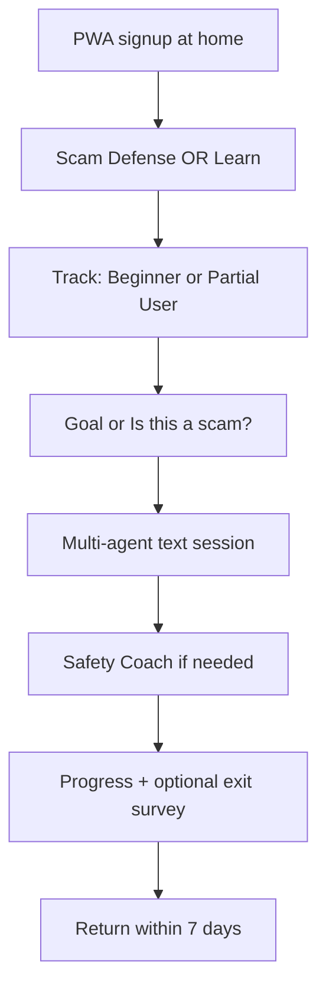
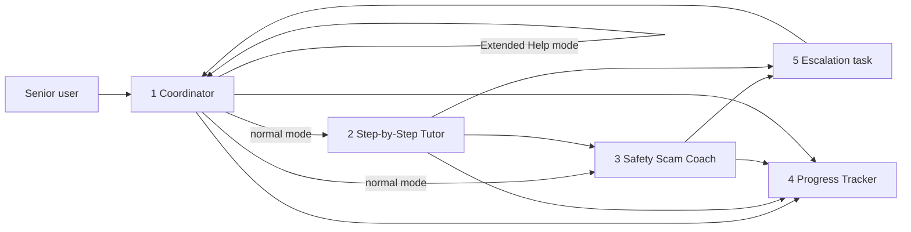

# Product Requirements Document (PRD)

## Document Metadata

| Field | Value |
|-------|-------|
| Product Name | Senior Digital Literacy Platform |
| Version | **2.2 (Final — MVP)** |
| Status | **Final — Define phase complete** |
| Primary Input | `project-context/1.define/mrd.md` (incl. §6 low-cost gap analysis) |
| Related Artifacts | `user-stories/` (US-001–US-021), `mrd.md` |
| System Description | N/A — MRD used as primary input |
| Selected Runtime | `crewai` (default; no `aamad.config.yml` present) |
| Delivery Model | **Path C — Full text agentic MVP** (MRD §6); community-only Phase 0 **not** leading |

---

## Finalized Product Decisions

| Decision | Resolution | Rationale |
|----------|------------|-----------|
| **Delivery path** | Build **full 5-agent text platform** now | No library partner; virtual beta needs a product channel (MRD §6 Path C minus voice) |
| **Voice** | **Tier A only** — optional browser Web Speech (speak-to-type / read-aloud) | Cloud STT/TTS and phone voice channel **deferred to P2** (`claude-agent-sdk`) — cost and complexity |
| **Beta audience** | **Margaret-first** — home users with personal smartphone/tablet | Partial User track primary; caregiver-assisted signup (David) |
| **Carmen / No-Device** | **Build in MVP** (track + visual-first UI); **beta validation deferred** until library/housing partner | No partner site now; design for Carmen, pilot when venue exists (P1-6) |
| **Community workshop pilot** | **Parallel outreach**, not a build gate | Partner acquisition continues during Build; does not block agentic MVP |
| **Content** | RAG indexes **free public curricula** first (DigitalLearn, TechBoomers, Senior Planet/OATS) + IC3/AARP scam corpus | Lowers content cost (MRD §6) |
| **Monetization** | **Free beta**; Stripe subscription **P1** after retention proof | — |
| **Runtime** | `crewai` sequential multi-agent | AAMAD default; voice Phase 2 may evaluate `claude-agent-sdk` |
| **LLM cost control** | Session token cap (default 8K agent-side); model tiering; progressive routing **P1** | MRD unit-economics requirement |
| **Beta tutor session cap** | **5 tutoring sessions per user per week** | Scam Defense checks/drills **unlimited** during beta |
| **Escalation (MVP)** | **Extended Help Mode** on **Coordinator** (same “Your guide” persona) | Triggered by Get extra help, distress, or Escalation Handler; AI disclosure in UI; no human callback MVP |
| **LLM provider (MVP)** | **Anthropic Claude** (Claude API) | Build may use Cursor IDE; runtime inference via Claude |
| **Visual step cards** | **Illustrated** assets (not icon-only) | No-Device + Beginner tracks; budget for simple senior-friendly illustrations |
| **Carmen partner pilot** | **Q4 2026** target | First library/housing MOU + No-Device beta cohort (P1-6) |

---

## 1. Executive Summary

### Problem Statement

U.S. adults aged 60+ face a persistent **ownership-without-mastery gap**: roughly 90% of adults 50+ own smartphones, yet approximately one-third do not feel they have the digital literacy skills to fully benefit from online services, with confidence declining sharply with age (AARP, 2024–2025). Privacy concerns, **scam fear**, and age-inappropriate design are top adoption barriers (AARP, 2025; OATS, 2025).

Americans aged 60+ reported **$7.75 billion in fraud losses in 2025**, a 59% year-over-year increase (FBI IC3, 2025). Existing solutions treat scam awareness as an add-on — not as the **headline reason to trust and return**. They also fail to serve learners at different starting points with appropriately paced, emotionally safe experiences.

**Target market scope (MVP beta):** U.S. English-speaking adults aged **65–79** who use a **personal smartphone or tablet at home** (Margaret persona), plus **family caregivers** who assist setup (David). **No-Device / Carmen cohort** and **Spanish/English bilingual** are in product scope but **not beta recruitment focus** until an institutional partner is secured.

### Solution Overview

**Senior Digital Literacy** is a **full text agentic** multi-agent AI platform (no voice channel on MVP) built on three pillars:

1. **Scam Defense First** — Headline home feature: check suspicious messages, drills, quiz, streaks.
2. **Persona-Specific Learning Tracks** — Beginner, Partial User, No-Device (built; beta emphasizes Partial + Beginner).
3. **Emotional Safety & Patience** — Product-level pause, frustration check-in, shame-free copy guardrails.

**AI coaches (crewai):** Coordinator *(incl. Extended Help Mode)* · Step-by-Step Tutor · Safety/Scam Coach · Progress Tracker · Escalation Handler *(routing only — not a chat persona)*

**UVP:** *"Your personal team of digital coaches — one guide who never rushes you, one teaches step by step, one protects you from scams, and one remembers what you've learned."*

**MVP pilot targets (virtual beta, n≈200):**

- ≥50% engage Scam Defense in session 1
- ≥60% task completion (Partial User goals)
- ≥40% 7-day retention
- ≥80% "felt respected" / "not rushed" on exit survey
- NPS ≥ 40

### Strategic Rationale

Multi-agent architecture separates **scam authority**, **pedagogy**, **progress**, and **escalation** — required for PRD pillars and MRD safety analysis. **`crewai`** supports reproducible YAML-defined agents for AAMAD Build.

**Delivery vs. MRD §6:** Stakeholder chose **full text agentic MVP** over community-assembly-first because there is **no library partner** and home-based seniors need an on-demand channel. MRD low-cost workshop model remains a **parallel partner strategy**, not the MVP product.

**Cost realism (MRD):** MVP build is **not** zero-cost (~$150–250K equivalent team effort or founder sweat-equity over 3–4 months). Run cost at beta scale **~$2.5–7K/mo** (infra + capped LLM). Voice would add **+$40–150K build** and **+$0.10–5/session** — **excluded from MVP**.

---

## 2. Market Context & User Analysis

### Target Market / Users

#### Primary Persona — MVP Beta Focus: Independent Senior (Margaret, 72)

| Attribute | Detail |
|-----------|--------|
| Age | 65–79 |
| Devices | Personal iPhone or Android; occasional tablet |
| **Learning track (beta default)** | **Partial User** |
| Goals | Video call family, safe banking view, scam checks, telehealth navigation |
| Beta channel | Direct signup or caregiver invite; **PWA on own device at home** |

#### Secondary Persona — MVP Beta: Family Caregiver (David, 48)

| Attribute | Detail |
|-----------|--------|
| Role | Sets up account, helps pick track, optional read-only progress (senior approval) |
| Beta channel | Primary acquisition lever when no library partner |

#### Tertiary Persona — Build MVP / Beta Deferred: Carmen (68)

| Attribute | Detail |
|-----------|--------|
| Context | Public housing; no personal device; library/housing computer |
| **Learning track** | No-Device User — **built in MVP**, beta cohort **deferred** |
| Language | Spanish-preferred — **bilingual P2** |
| **When to beta** | **Q4 2026** — library, housing authority, or senior-center partner (P1-6) |

#### Quaternary Persona — Post-MVP: Activities Director

Institutional kiosk/workshop distribution — P1-3, P1-6.

### Persona-Specific Learning Tracks

| Track | MVP build | MVP beta focus |
|-------|-----------|----------------|
| **Partial User** | ✅ | **Primary** (Margaret) |
| **Beginner** | ✅ | **Secondary** |
| **No-Device User** | ✅ (visual-first, shared-device mode) | **Deferred** (Carmen — needs partner venue) |

Track assignment, switching, and examples unchanged from v1.1 (see user stories US-004, US-005, US-008, US-015).

### User Journey (MVP Beta — Margaret Path)

### Competitive Landscape

Unchanged from v1.1 — differentiation: Scam Defense headline, three tracks, emotional safety as product behavior, multi-agent vs. single chatbot.

---

## 3. Technical Requirements & Architecture

### Runtime & Agent Specifications

| Parameter | MVP Value |
|-----------|-----------|
| Runtime | `crewai` |
| Process mode | Sequential |
| Agent config | `config/agents.yaml`, `config/tasks.yaml` |
| Agents | **5** — see §3 Agent definitions below |
| Coordinator `max_iter` | ≤ 12 in Extended Help Mode; ≤ 8 in normal routing mode |
| Memory | `memory=False`; state in PostgreSQL |
| Session token cap | 8K agent-side (configurable) |

### Agent Definitions (MVP — all AI; Claude API)

Agent definitions (MVP — all **AI**, no human agents). Inference via **Anthropic Claude API**. Orchestration: **sequential** `crewai` process; Coordinator is session entry point.

---

#### Agent 1: `coordinator`

| Field | Value |
|-------|-------|
| **Display name (UI)** | Your guide *(same persona in normal and Extended Help Mode)* |
| **role** | Session Coordinator, Learning Track Advocate, Emotional Safety Guardian, and **Extended Help provider** |
| **goal** | Understand the learner's goal; maintain learning track; pace sessions with patience; route to specialists; detect frustration; and when extra support is needed, **stay with the learner** in Extended Help Mode — patient, extended, simplified assistance with honest AI disclosure |
| **backstory** | A calm community center director who never sighs, never rushes, and checks in before moving on. When you need more time, the same guide slows down further — never hands you to a stranger and **never pretends to be human**. |
| **tools** | `learner_state_read`, `learner_state_write`, `set_learning_track`, `delegate_to_tutor`, `delegate_to_safety`, `delegate_to_progress`, `detect_frustration_signal`, `offer_pause`, `enter_extended_help_mode`, `exit_extended_help_mode`, `simplify_explanation`, `recommend_ic3_aarp_resources`, `trigger_active_scam_guidance` |
| **Modes** | **Normal:** route to Tutor / Safety Coach; emotional check-ins; track management. **Extended Help:** longer turns, re-explain, active-scam immediate steps, IC3/AARP links; triggered by Get extra help, Escalation Handler, or Coordinator frustration/distress detection |
| **Inputs** | User message, session context, learning track, goal, escalation signals |
| **Outputs** | Routing decisions; pace/check-in messages; **Extended Help responses** when in that mode |
| **Prohibited** | Giving scam verdicts without Safety Coach in normal mode; impersonating a human; shame language; tutorial step-by-step in normal mode (delegate to Tutor) |
| **runtime notes** | Session entry point; Extended Help **must disclose AI** on mode entry; Extended Help counts toward **5 tutor sessions/week**; never auto-switches track without user consent |

---

#### Agent 2: `step_by_step_tutor`

| Field | Value |
|-------|-------|
| **Display name (UI)** | Your tutor |
| **role** | Track-Aware Step-by-Step Technology Tutor |
| **goal** | Guide the learner through one verified step at a time toward their life goal using RAG-grounded instructions adapted to their track |
| **backstory** | An experienced community tech volunteer who explains things simply, repeats without judgment, and never skips steps. Adapts pacing and visuals to Beginner, Partial, and No-Device learners. |
| **tools** | `rag_search_tutorials`, `get_device_context`, `get_learning_track`, `simplify_explanation`, `confirm_step_complete`, `render_visual_step_card` |
| **Track behavior** | **Beginner:** micro-steps + device basics first. **Partial User:** standard one-step life-goal flow. **No-Device:** illustrated visual step cards, minimal prose, public-computer safety reminders. |
| **Inputs** | Delegated task from Coordinator, learner goal, track, device context |
| **Outputs** | Single step per turn (or micro-step for Beginner), verified guide indicator when RAG-sourced, illustrated card payload when No-Device/Beginner |
| **Prohibited** | Multiple steps in one turn (unless user asks to repeat); generative answers for banking/security-sensitive tasks; shame language |
| **runtime notes** | RAG-only for sensitive tasks; Task.guardrail for jargon and step count; counts toward 5 tutor sessions/week cap |

---

#### Agent 3: `safety_scam_coach`

| Field | Value |
|-------|-------|
| **Display name (UI)** | Safety coach |
| **role** | Headline Digital Safety and Scam Defense Coach |
| **goal** | Lead scam recognition, message analysis, scenario drills, and daily defense habits; detect live scam patterns; coach without panic or blame |
| **backstory** | A retired fraud investigator and community workshop leader. Protects seniors with calm clarity and celebrates every scam they avoid. Never blames the victim. |
| **tools** | `rag_search_scam_patterns`, `assess_risk_level`, `run_scam_scenario`, `recommend_safe_action`, `signal_escalation`, `record_scam_milestone` |
| **Inputs** | Suspicious message text, call description, user question, or interrupt signal from tutoring session |
| **Outputs** | Plain-language risk assessment, recommended actions, drill/quiz content, milestone events |
| **Prohibited** | Alarmist tone; blaming user; claiming to be law enforcement or a bank |
| **runtime notes** | First-class Scam Defense hub entry; can interrupt tutoring; IC3/AARP RAG corpus; does not count toward weekly tutor session cap |

---

#### Agent 4: `progress_tracker`

| Field | Value |
|-------|-------|
| **Display name (UI)** | Your progress (summary UI only) |
| **role** | Learning Progress, Scam Defense, and Confidence Milestone Recorder |
| **goal** | Record completed steps, track changes, scam quiz scores, defense streaks, and session summaries for continuity across visits |
| **backstory** | An encouraging librarian who remembers what you have learned and celebrates small wins without oversharing to family unless the senior opts in. |
| **tools** | `learner_state_read`, `learner_state_write`, `record_milestone`, `record_scam_milestone`, `record_track_change`, `generate_session_summary`, `get_scam_streak` |
| **Inputs** | Step completions, quiz scores, drill results, track changes, session end signal |
| **Outputs** | Updated learner state, session summary, continue pointers, caregiver-safe aggregate counts (no message content) |
| **Prohibited** | Long conversational tutoring; storing raw suspicious messages in caregiver-visible fields; logging emotional check-ins for caregivers |
| **runtime notes** | Runs after tutoring and Scam Defense segments; persists learning_track, track_history, scam_streak_days, scam_defense_level |

---

#### Agent 5: `escalation_handler`

| Field | Value |
|-------|-------|
| **Display name (UI)** | *(No chat UI — internal routing task)* |
| **role** | Escalation Assessor and Mode Switch Trigger |
| **goal** | Evaluate escalation triggers and activate **Coordinator Extended Help Mode** or active-scam safety flow — without introducing a separate chat persona |
| **backstory** | N/A — non-conversational crew task |
| **tools** | `assess_escalation_need`, `activate_coordinator_extended_help`, `trigger_active_scam_guidance`, `log_escalation_event` |
| **Triggers** | User taps Get extra help; Safety Coach critical risk; Tutor low confidence; distress keywords; 3 failed simplifications; active scam in progress |
| **Outputs** | Signal to Coordinator to enter/exit Extended Help Mode; escalation log (no credentials) |
| **Prohibited** | Conversational replies to user; promising human callback in MVP; separate “partner tutor” persona |
| **runtime notes** | Implemented as **CrewAI task** invoked by Coordinator or Safety Coach; not a user-visible agent; human webhook **P1** |

---

### Agent collaboration flow (MVP)

| Session type | Primary agents | Weekly cap |
|--------------|----------------|------------|
| Learn a skill | Coordinator → Tutor (+ Safety interrupt) → Progress | Counts (5/week) |
| Scam Defense check/drill/quiz | Coordinator → Safety Coach → Progress | Uncapped |
| Get extra help | Coordinator → Escalation task → **Coordinator Extended Help Mode** → Progress | Counts (5/week) |

| Role | MVP | P1+ |
|------|-----|-----|
| Five agents / tasks | All AI (Claude) | AI |
| Extended Help | **Coordinator mode** (not separate agent) | Same |
| Live human callback | None | Optional webhook |

### Voice & Modality (Final)

| Tier | Scope | MVP |
|------|-------|-----|
| **A — Browser Web Speech** | Optional speak-to-type; optional read-aloud of step text | **✅ Optional** |
| **B — Cloud STT/TTS** | ElevenLabs, Whisper API, Polly, etc. | **❌ P2** |
| **C — Phone / voice agent** | `claude-agent-sdk`, Twilio, realtime voice LLM | **❌ P2** |

**MVP is text-first.** Voice is not a primary input modality; no telephony integration.

### Integration Requirements

| Integration | MVP | P1/P2 |
|-------------|-----|-------|
| **LLM API — Anthropic Claude** | **Required (primary)** | Multi-model failover P1 |
| Vector store (RAG) | Required — scam corpus first | — |
| PostgreSQL | Required | — |
| Redis | Optional | Recommended at scale |
| Browser Web Speech API | Optional (Tier A) | — |
| **Human escalation webhook** | **❌ Deferred P1** | Live human guide queue |
| **Extended Help Mode** | **Coordinator** (not separate agent) | May add human handoff P1 |
| Stripe | ❌ | P1 |
| Spanish i18n | ❌ | P2 |
| Library/kiosk hardened mode | ❌ | P1 (with partner) |

### Content Strategy (Final)

1. **Scam corpus first** — IC3/AARP patterns; ≥10 drills (F1, F9).
2. **Tutorial RAG** — ≥50 guides tagged by track; **source from DigitalLearn, TechBoomers, Senior Planet/OATS** where licensed/public; custom handouts only to fill gaps.
3. **Sensitive tasks** — RAG-only; no generative fallback.

### Performance, Security, Infrastructure

Unchanged from v1.1 §3 (p95 ≤5s chat, WCAG 2.1 AA, shared-device mode for No-Device track, US single-region deploy).

---

## 4. Functional Requirements

### Core Features (P0) — Summary

| ID | Feature | Beta priority |
|----|---------|---------------|
| **F1** | Scam Defense Hub (headline) | **P0 — beta critical** |
| **F2** | Three learning tracks | **P0 — Partial/Beginner beta** |
| **F3** | Goal-based onboarding | P0 |
| **F4** | Multi-agent text tutoring | P0 |
| **F5** | Emotional safety system | P0 |
| **F6** | Progress + scam streaks | P0 |
| **F7** | Coordinator Extended Help Mode (+ active-scam safety flow) | P0 |
| **F8** | Accessible PWA + **illustrated** visual-first No-Device mode | P0 build; No-Device **beta Q4 2026** |
| **F9** | RAG corpus (free curricula + scam) | P0 |

Full acceptance criteria: see v1.1 §4 and `user-stories/US-001` through `US-021`.

### P1 — Post-Beta

P1-1 Stripe · P1-2 Caregiver dashboard · P1-3 Library/kiosk mode · P1-4 Email/SMS reminders · P1-5 Model tiering · **P1-6 Partner pilot pack (Carmen recruitment)**

### P2 — Future

Spanish/English bilingual · Cloud STT/TTS · Phone voice agent · Native apps · Screen share · B2B white-label · HIPAA · SOC 2

---

## 5. Non-Functional Requirements

Unchanged from v1.1: performance targets, emotional safety NFRs, WCAG 2.1 AA, CCPA, session caps, pilot disaster recovery.

### Cost Controls (NFR — Final)

| Control | MVP |
|---------|-----|
| Token cap per session | 8K default; hard stop with friendly message |
| **Tutor sessions per user** | **5 per calendar week** (Scam Defense unlimited) |
| Beta user ceiling | ~200 concurrent design; 100 concurrent sessions |
| LLM provider | **Anthropic Claude** (single model MVP) |
| Infra budget target | $2–5K/mo at pilot (MRD) |

---

## 6. User Experience Design

Unchanged pillars: Scam Defense hero, track badge, pause always visible.

**Beta UX default:** Mobile-first PWA on personal phone; home screen **Scam Defense + Learn** equal weight; remember last entry **P1** (default: balanced home for all users at launch).

**Visual step cards (Final):** **Illustrated** senior-friendly artwork per step (No-Device + Beginner); not icon-only. Simple, high-contrast, minimal text overlay; alt text for accessibility.

**Voice UX:** Microphone button for browser dictation where supported; **no** voice-only mode or phone-call UI on MVP.

---

## 7. Success Metrics & KPIs

### MVP Virtual Beta (Margaret-first, n≈200)

| Metric | Target | Notes |
|--------|--------|-------|
| Activation | 200 accounts + 1 session | Caregiver + direct |
| Scam Defense session 1 | ≥50% | Primary KPI |
| Task completion (Partial) | ≥60% | Top 5 goals |
| 7-day retention | ≥40% | |
| "Felt respected" / "Not rushed" | ≥80% each | Exit survey |
| NPS | ≥40 | |
| No-Device track beta | **Q4 2026** | With Carmen partner (P1-6) |
| Escalation rate | ≤15% | |

Technical metrics unchanged (p95 latency, 0 critical scam misses on audit sample, WCAG 0 critical).

---

## 8. Implementation Strategy

### Phase Sequence (Final)

| Phase | Deliverable | Status |
|-------|-------------|--------|
| **Define** | MRD, PRD, user stories | **Complete** |
| **Define** | SAD (`@system.arch`) | **Next** |
| **Build** | crewai backend + RAG + PWA | 3–4 months |
| **Beta** | Virtual cohort (Margaret/David) | Free; capped sessions |
| **P1** | Monetization, human escalation option, Carmen Q4 pilot | Carmen **Q4 2026** |

### MVP Scope Boundary (Final)

**In MVP — ship:**

- Full **5-agent** text platform (crewai): Coordinator *(incl. Extended Help)*, Tutor, Safety Coach, Progress Tracker, Escalation task
- Scam Defense headline · three tracks · emotional safety
- Text PWA WCAG 2.1 AA · optional browser speech (Tier A)
- RAG from free curricula + scam corpus · **Claude API**
- **Illustrated** visual step cards (No-Device + Beginner)
- **Get extra help** → Coordinator **Extended Help Mode** (same “Your guide” + AI disclosure); no human callback queue in MVP
- No-Device track in product; **Carmen beta Q4 2026**

**Out of MVP — do not build:**

- Live human escalation webhook / callback queue (**P1**)

- Cloud STT/TTS · phone voice agent · native apps · screen share
- Stripe · Spanish i18n · enterprise SSO
- Hardened library kiosk (until partner — P1)
- Community-only workshop as substitute for product

### Resource & Budget (Indicative — MRD)

| Item | Estimate |
|------|----------|
| MVP engineering | 3–4 months; ~$150–250K equivalent or founder-built |
| Beta monthly ops | ~$2.5–7K (infra + capped LLM) |
| Voice (if added later) | +$40–150K build; +per-session API cost |

### Risk Mitigation

| Risk | Mitigation |
|------|------------|
| No library partner | Virtual beta; David channel; partner outreach parallel |
| LLM cost | Session caps; beta size limit; tiering P1 |
| Carmen underserved in beta | Q4 2026 partner pilot; illustrated cards + No-Device track ready at Build |
| Extended Help trust | Same Coordinator persona; mode-entry AI disclosure; active-scam → IC3/AARP resources |
| Wrong instructions | RAG-only; free verified curricula |
| Building before demand proof | Beta KPIs gate P1 spend and monetization |

---

## 9. Launch & Go-to-Market Strategy (Final)

### Primary — Virtual B2C Beta

- **Audience:** Seniors 65–79 with own smartphone/tablet + caregiver-assisted signup
- **Message:** *"Protect yourself from scams — then learn at your pace"*
- **Channels:** Caregiver referrals, senior community groups, local AARP/church networks, word of mouth
- **Pricing:** Free during beta; **unlimited Scam Defense**; **5 tutor sessions per user per week**
- **No library partner required** to launch beta

### Secondary — Partner Pipeline (Carmen Q4 2026)

- Outreach to libraries, housing authorities, senior centers for **Q4 2026** Carmen cohort and P1-6 kiosk pack
- Optional: printed scam one-pagers at events (low-cost MRD §6 tactic) driving PWA signup QR

### Post-Beta Pricing (P1)

| Tier | Price |
|------|-------|
| Free | Scam Defense + limited tutor sessions |
| Standard | $9.99/mo |
| Premium | $19.99/mo |

### Pre-Beta Checklist

- [ ] SAD approved (`@system.arch`)
- [ ] 8–12 senior interviews (Margaret/David focus)
- [ ] Scam hub first-entry usability test
- [ ] Partial + Beginner track E2E validated
- [ ] Emotional safety copy review
- [ ] WCAG audit on core flows
- [ ] Scam + tutorial RAG validated (free sources indexed)
- [ ] Coordinator Extended Help Mode + disclosure copy validated with seniors
- [ ] Illustrated step card set for Beginner + No-Device sample paths
- [ ] Claude API integration + session/week caps enforced
- [ ] QA + security assessments
- [ ] `aamad validate --phase define` after SAD

---

## Quality Assurance Checklist

- [x] Requirements traceable to MRD (incl. §6 delivery fork — Path C text chosen)
- [x] Feasible with `crewai` adapter
- [x] Success metrics aligned with pillars and beta scope (Margaret-first)
- [x] MVP vs P1/P2 explicit (voice, Carmen beta, monetization)
- [x] Finalized decisions documented (§ Finalized Product Decisions)
- [x] User stories US-001–US-021 trace to P0 features
- [x] Cost and voice tiers documented

---

## Sources

1. `project-context/1.define/mrd.md` — market, technical, §6 low-cost gap analysis
2. `project-context/1.define/user-stories/` — acceptance criteria
3. Stakeholder sessions — tracks, scam headline, emotional safety, Carmen (2026-08-10); delivery/voice/beta (2026-08-10); **session cap, AI Partner Tutor, Claude, illustrations, Q4 Carmen** (2026-08-10)
4. `.cursor/templates/prd-template.md`
5. Free curriculum sources: DigitalLearn.org, TechBoomers, Senior Planet/OATS (MRD §6)
6. MRD research citations: AARP, FBI IC3, OATS, W3C WCAG 2.1

---

## Assumptions

- **`crewai`** is the Build runtime; **`claude-agent-sdk`** evaluated for P2 voice only.
- **LLM inference:** **Anthropic Claude API** for all MVP agents; Cursor IDE may be used for development — not a production LLM endpoint.
- **Beta caps:** **5 tutor sessions/user/week**; Scam Defense checks, drills, and quiz **uncapped** during beta.
- **Escalation MVP:** **Coordinator Extended Help Mode** (same guide persona); UI discloses AI on mode entry. Live human callback **P1**. Active scam: immediate safety steps + IC3/AARP links.
- **Visual step cards:** **Illustrated** assets required for No-Device and Beginner tracks (not icon-only).
- **Carmen partner pilot:** target **Q4 2026** (P1-6).
- **Full text agentic MVP** proceeds without library partner until Q4; virtual beta is valid GTM until then.
- **No-Device track** ships in product; Carmen cohort beta **Q4 2026**.
- **Tier A browser speech** is best-effort; typing always fully supported.
- **Free beta** with session caps; monetization P1.
- **RAG** prioritizes free public curricula; licensing/terms respected per source.
- **Home screen** shows balanced Scam Defense + Learn at launch (no "remember last" until P1).
- **Track assignment** is self-select at onboarding; Coordinator **suggests** switch after frustration signals but does not auto-change track without user consent in MVP.
- **Telehealth tutorials** are navigation-only; no credential entry (HIPAA avoided).
- **Emotional check-ins** not shared with caregivers.
- **Phase 0 community-only workshop** is complementary outreach, not a substitute for this PRD scope.

---

## Open Questions

*All prior open questions resolved as of v2.1 (2026-08-10). New items for SAD/architect:*

1. **Claude model tier for MVP:** Haiku for Progress vs. Sonnet for Coordinator (incl. Extended Help), Tutor, Safety — confirm in SAD.
2. **Illustration source:** Custom commission vs. licensed stock vs. generated assets — confirm art pipeline before frontend build.
3. **Get extra help label:** Confirm copy (e.g., “Get extra help from your guide”) — gerontology review; must not imply human.

*Architect handoff:* `@system.arch` → `*create-sad` using this PRD and user stories.

---

## Audit

| Field | Value |
|-------|-------|
| Timestamp | 2026-08-10T16:35:00Z |
| Persona id | `product-mgr` |
| Action | `create-prd` — **finalize v2.2** (Partner Tutor merged into Coordinator) |
| Prior version | 2.1 Final |
| Resolved runtime | `crewai` |
| LLM provider | Anthropic Claude (API) |
| Escalation MVP | Coordinator **Extended Help Mode** (5 agents) |
| Beta tutor cap | 5 sessions/user/week |
| Carmen pilot | Q4 2026 |
| Visual step cards | Illustrated |
| Model | Composer |
| Inputs | `mrd.md`, user-stories, stakeholder finalization session |
| Prompt Trace | Omitted — PRD finalization with documented decisions |
