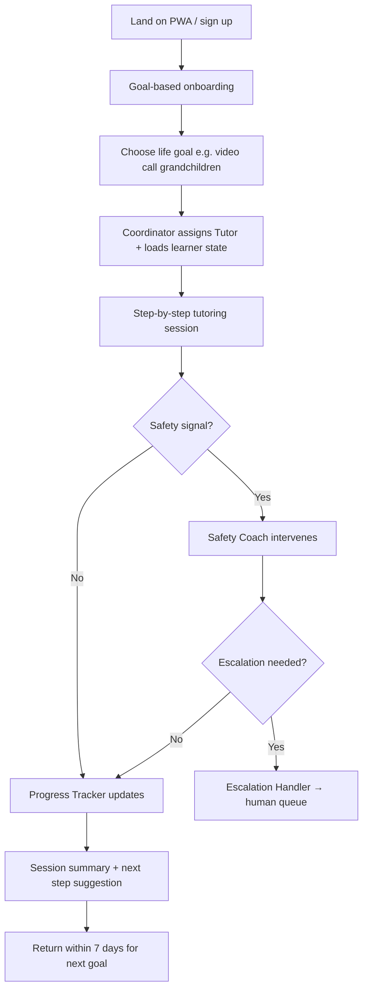

# Product Requirements Document (PRD)

## Document Metadata

| Field | Value |
|-------|-------|
| Product Name | Senior Digital Literacy Platform |
| Version | 1.0 (MVP) |
| Status | Draft — Define phase |
| Primary Input | `project-context/1.define/mrd.md` |
| System Description | N/A — MRD used as primary input |
| Selected Runtime | `crewai` (default; no `aamad.config.yml` present) |

---

## 1. Executive Summary

### Problem Statement

U.S. adults aged 60+ face a persistent **ownership-without-mastery gap**: roughly 90% of adults 50+ own smartphones, yet approximately one-third do not feel they have the digital literacy skills to fully benefit from online services, with confidence declining sharply with age (AARP, 2024–2025). Privacy concerns, scam fear, and age-inappropriate design are top adoption barriers (AARP, 2025; OATS, 2025).

The financial and emotional impact is severe. Americans aged 60+ reported **$7.75 billion in fraud losses in 2025**, a 59% year-over-year increase (FBI IC3, 2025). Tech-support scams alone accounted for $1.04 billion in losses among seniors. Existing solutions — live classes (Senior Planet, GetSetUp), single-chatbot apps (TechMaid), or device-specific tutors (TechMentor) — fail to deliver **on-demand, personalized, multi-role coaching** that combines step-by-step tutoring, scam awareness, and measurable progress at 2 a.m. when anxiety strikes.

**Target market scope (MVP):** U.S. English-speaking adults aged **65–79**, with secondary support for family caregivers who assist with setup and optional progress sharing.

### Solution Overview

**Senior Digital Literacy** is a multi-agent AI platform that provides patient, step-by-step technology tutoring, integrated scam-awareness coaching, and progress tracking through a team of specialized AI coaches:

- **Coordinator** — routes requests, maintains learner context, and paces interactions
- **Step-by-Step Tutor** — delivers one-step-at-a-time guidance grounded in verified content
- **Safety/Scam Coach** — detects scam patterns, coaches recognition, and triggers escalation
- **Progress Tracker** — records completed tasks, skill paths, and confidence milestones
- **Escalation Handler** — hands off to human support when AI confidence is low or user is in distress

**Unique value proposition:** *"Your personal team of digital coaches — one teaches, one protects, one remembers what you've learned."*

**Key differentiators vs. alternatives:**

| Gap in market | Our approach |
|---------------|--------------|
| Class-based models lack on-demand private practice | 24/7 agentic tutoring from life goals, not feature menus |
| Single-chatbot competitors mix pedagogy and safety | Dedicated agents reduce conflicting advice |
| Limited structured progression | Centralized learner-state with skill pathways |
| Weak accessibility | WCAG 2.1 AA+ PWA: large text, high contrast, voice input, ≤3 nav levels |

**Expected outcomes (MVP pilot):**

- 60%+ task completion rate on first guided session for top-5 use cases
- 40%+ 7-day return usage among beta cohort
- Measurable scam-quiz score improvement after Safety Coach interaction
- NPS ≥ 40 among beta seniors (65–79)

### Strategic Rationale

**Why multi-agent architecture:**

1. **Pedagogical separation** — Tutoring pacing and safety interventions require different prompts, guardrails, and escalation logic; a single agent conflates these roles (MRD §2, §5).
2. **Proven ITS patterns** — ITAS, IntelliCode, and AIA-PAL demonstrate coordinator + specialist decomposition with centralized learner state (MRD §2).
3. **Safety-critical routing** — Scam detection must override tutoring flow with conservative escalation; a dedicated Safety Coach agent enables hard guardrails without disrupting the Tutor's pedagogical tone.
4. **Runtime alignment** — `crewai` sequential process mode supports reproducible, YAML-externalized agent/task definitions aligned with AAMAD Build conventions (MRD §2; adapter registry).

**Business case:**

- Addressable segment: senior tech services (~$11.5B, 2025) and digital inclusion training (~$15B, 2025) with 10–12% CAGR (MRD §1).
- MVP monetization path: B2C freemium/subscription ($9.99–$19.99/mo benchmark) with parallel B2B2C pilot pipeline (senior living, libraries, health plans).
- Unit economics require session caps, model tiering, and institutional contracts at scale (MRD §2, §4).

**Market timing:** AI usage among U.S. 50+ doubled to ~30% in 2025 (AARP), reducing stigma; elder fraud losses are at record highs, creating urgency for trustworthy digital safety coaching.

---

## 2. Market Context & User Analysis

### Target Market / Users

#### Primary Persona: Independent Senior (Margaret, 72)

| Attribute | Detail |
|-----------|--------|
| Age | 65–79 |
| Location | U.S., suburban/urban, English-primary |
| Devices | iPhone or Android smartphone; occasional tablet |
| Tech comfort | Uses phone for calls/texts; struggles with video calls, email attachments, banking apps |
| Goals | Video call grandchildren, check bank balance safely, avoid scams, use telehealth portal |
| Fears | Clicking wrong button, losing money to scams, bothering family for help |
| Success factor | Patient, plain-language, one step at a time; no time pressure |

#### Secondary Persona: Family Caregiver (David, 48)

| Attribute | Detail |
|-----------|--------|
| Relationship | Adult child of senior user |
| Role | Sets up account, monitors optional progress, receives escalation alerts |
| Goals | Reduce "tech support" calls; ensure parent stays safe online |
| Constraint | Must respect senior's privacy; sharing is senior-controlled |

#### Tertiary Persona (Post-MVP): Activities Director (Senior Living)

| Attribute | Detail |
|-----------|--------|
| Context | Senior living community or library kiosk operator |
| Goals | Offer residents on-demand digital literacy without staffing 24/7 |
| MVP scope | Documented for B2B2C pipeline; not in MVP feature set |

**Market segment size (directional):**

- U.S. adults 65+: ~58M (2025 baseline; UN DESA / Census-derived)
- Senior tech services TAM: $11.52B (2025) → $22.62B (2032), CAGR 10.3% (QY Research)
- Digital inclusion training: $15B (2025) → $40B (2033), CAGR 12% (FutureDataStats)

**Geographic focus:** U.S. English MVP. Expansion path: Spanish (U.S.), then EU evaluation (MRD §1 Open Questions).

### User Needs Analysis

#### Critical Pain Points

1. **Confidence gap** — Device ownership without mastery; comfort drops with age (AARP, 2024).
2. **Scam fear blocks adoption** — 25% of 50+ cite trust/privacy as greatest barrier (OATS, 2025).
3. **Cognitive overload** — Multi-step UIs, jargon, and time pressure cause abandonment.
4. **Relational motivation** — Users learn for video calls, email, telehealth — not "technology" abstractly.
5. **Isolation of failure** — Shame prevents asking family; need private, judgment-free practice.

#### User Journey (MVP)

#### Adoption Barriers & Success Factors

| Barrier | Mitigation (MVP) |
|---------|------------------|
| Low trust in AI | Plain-language disclaimers; no training on conversations without consent; nonprofit advisory credibility |
| Privacy concerns | Senior-owned accounts; explicit caregiver sharing opt-in |
| Accessibility failures | WCAG 2.1 AA: ≥16px body, 4.5:1 contrast, ≥44×44 touch targets |
| Wrong/harmful instructions | RAG-only for sensitive tasks; confidence thresholds; human escalation |
| Cost | Freemium tier with limited sessions; premium subscription |

### Competitive Landscape

| Competitor | Model | Strength | Gap we fill |
|------------|-------|----------|-------------|
| Senior Planet (OATS) | Free classes, 400+ sites | Trust, scale | Not on-demand personalized multi-agent |
| GetSetUp | Live + on-demand + Helen AI | Health plan distribution | Single assistant; no structured multi-agent path |
| TechMaid | Web chat + human callback | Human fallback | Single chatbot; no progress curriculum |
| TechMentor | iOS + screen-share AI | Device guidance | Apple-only; limited safety coaching |
| OLAI | Task companion (UK) | Guided tasks | Limited U.S. presence |

**Pricing benchmarks:** TechMentor $9.99 Standard / $19.99 Premium; TechMaid freemium/paid tiers (MRD §3, §5).

---

## 3. Technical Requirements & Architecture

### Runtime & Agent Specifications

| Parameter | MVP Value |
|-----------|-----------|
| Runtime | `crewai` |
| Process mode | Sequential (reproducible tutoring flows) |
| Agent config | Externalized YAML (`config/agents.yaml`, `config/tasks.yaml`) |
| Orchestration | Coordinator delegates to specialists; centralized learner-state document |
| max_iter | ≤ 12 per agent task (MVP default per adapter rules) |
| max_retry_limit | ≥ 2 |
| Memory | `memory=False` (reproducibility; learner state in DB, not agent memory) |
| Delegation | `allow_delegation=false` unless Coordinator explicitly routes |

### Core Agent Definitions

#### Agent: coordinator

| Field | Value |
|-------|-------|
| role | Session Coordinator and Learner Advocate |
| goal | Understand the senior's life goal, maintain learner context, route to the right specialist, and ensure one-step-at-a-time pacing |
| backstory | A patient guide who never rushes. Speaks in plain language, confirms understanding before advancing, and knows when to bring in the Safety Coach or a human helper. |
| tools | learner_state_read, learner_state_write, delegate_to_tutor, delegate_to_safety, delegate_to_progress, trigger_escalation |
| runtime notes | Entry point for all sessions; max_iter 8; no direct RAG answers — delegates to Tutor |

#### Agent: step_by_step_tutor

| Field | Value |
|-------|-------|
| role | Patient Step-by-Step Technology Tutor |
| goal | Guide the senior through one verified step at a time toward their chosen life goal using RAG-grounded instructions |
| backstory | Experienced community tech volunteer who explains things simply, repeats without judgment, and never skips steps. |
| tools | rag_search_tutorials, get_device_context, simplify_explanation, confirm_step_complete |
| runtime notes | RAG-only for banking/security-adjacent tasks; Task.guardrail for step count and jargon detection |

#### Agent: safety_scam_coach

| Field | Value |
|-------|-------|
| role | Digital Safety and Scam Awareness Coach |
| goal | Detect scam patterns in user messages, coach recognition in plain language, and recommend safe actions without causing panic |
| backstory | Retired fraud investigator who protects seniors with calm, clear advice and never blames the victim. |
| tools | rag_search_scam_patterns, assess_risk_level, recommend_safe_action, trigger_escalation |
| runtime notes | Conservative escalation threshold; can interrupt Tutor flow; IC3/AARP scam corpus |

#### Agent: progress_tracker

| Field | Value |
|-------|-------|
| role | Learning Progress and Milestone Recorder |
| goal | Record completed steps, skill paths, scam quiz results, and session summaries for continuity across visits |
| backstory | Encouraging librarian who remembers what you've learned and celebrates small wins. |
| tools | learner_state_read, learner_state_write, record_milestone, generate_session_summary |
| runtime notes | Runs after tutoring segments; no user-facing conversational tone required |

#### Agent: escalation_handler

| Field | Value |
|-------|-------|
| role | Human Handoff Coordinator |
| goal | Package context for human support when AI confidence is low, fraud is in progress, or user requests a person |
| backstory | Warm receptionist who connects seniors to real help quickly and explains what will happen next. |
| tools | create_escalation_ticket, notify_human_queue, send_user_reassurance |
| runtime notes | MVP: webhook/email to contracted guide queue; SLA target 24 hours (TechMaid benchmark) |

### Integration Requirements

| Integration | MVP | Phase 2 |
|-------------|-----|---------|
| LLM API (Anthropic/OpenAI) | Required | — |
| Vector store (RAG) | Required (e.g., Chroma, pgvector) | — |
| PostgreSQL (learner state, sessions) | Required | — |
| Redis (session cache) | Optional | Recommended at scale |
| Speech-to-text / text-to-speech | Optional (browser Web Speech API) | Native voice channel |
| Human escalation webhook | Required (email/Slack/webhook) | CRM integration |
| Payment (Stripe) | P1 — freemium without payment in earliest beta | Required for B2C |
| Screen sharing | Deferred | TechMentor parity |
| OAuth / SSO | Email + magic link MVP | Enterprise SSO |

### Authentication & Security (MVP)

- Email + magic link or simple password (senior-friendly; no complex MFA at launch)
- Senior-owned account; caregiver linked via invite with explicit senior approval
- API keys and secrets via environment variables only
- HTTPS everywhere; PII minimization; no conversation content in application logs
- No storage of health data (PHI) in MVP — telehealth tutorials are navigation-only, not portal login assistance with credentials

### Performance & Scalability Targets (MVP)

| Metric | Target |
|--------|--------|
| First agent response (p95) | ≤ 5 seconds |
| Step response (p95) | ≤ 3 seconds |
| Concurrent sessions (pilot) | 100 |
| Availability | 99.5% (single-region US) |
| Session token budget | Cap per session (configurable; default 8K tokens agent-side) |

### Infrastructure Specifications (MVP)

| Component | Specification |
|-----------|---------------|
| Hosting | Single-region cloud (US); Docker Compose or single-service deploy |
| Compute | 2 vCPU / 4GB RAM minimum for API + crew runtime |
| Database | PostgreSQL 15+ |
| Object storage | Tutorial media/images (S3-compatible) |
| CDN | Static PWA assets |
| Monitoring | Structured logs; error tracking; agent escalation rate dashboard |
| Feature flags | Agent prompts and RAG corpus versioned and flag-gated |

---

## 4. Functional Requirements

### Core Features (Priority P0)

#### F1: Goal-Based Onboarding

**User story:** As a senior user, I want to tell the app what I want to accomplish (e.g., "video call my grandchildren") so that I receive relevant guidance instead of a generic tech menu.

**Acceptance criteria:**

- [ ] Onboarding presents ≥5 life-goal options (video calling, email, banking view-only, telehealth navigation, scam awareness)
- [ ] User can describe a custom goal in plain language
- [ ] Coordinator captures goal and initializes learner-state record
- [ ] Onboarding completes in ≤5 screens with ≤3 navigation levels
- [ ] All onboarding UI meets WCAG 2.1 AA (contrast, touch targets, font size)

#### F2: Multi-Agent Chat Tutoring Session

**User story:** As a senior user, I want patient step-by-step instructions so that I can complete a digital task without feeling rushed or confused.

**Acceptance criteria:**

- [ ] Coordinator receives user message and routes to Step-by-Step Tutor
- [ ] Tutor returns exactly one step per turn unless user requests repetition
- [ ] Tutor responses grounded in RAG corpus; citations or "verified guide" indicator shown
- [ ] "Explain simpler" action available on every tutor turn
- [ ] "Start over" and "Repeat last step" actions available
- [ ] Session persists across browser refresh (learner state in DB)

#### F3: Safety/Scam Coach Intervention

**User story:** As a senior user, I want the app to warn me when something looks like a scam so that I can avoid losing money.

**Acceptance criteria:**

- [ ] Safety Coach evaluates user messages for scam patterns (tech support, grandparent, IRS, romance, recovery scams)
- [ ] High-risk detection triggers Safety Coach response within same session turn
- [ ] Safety Coach provides plain-language explanation and recommended safe actions
- [ ] User can access "Is this a scam?" mode from main navigation
- [ ] Scam quiz (≥5 questions) available as standalone activity with score recorded by Progress Tracker

#### F4: Progress Tracking & Session Summary

**User story:** As a senior user, I want the app to remember what I've learned so that I can pick up where I left off.

**Acceptance criteria:**

- [ ] Progress Tracker records completed steps, goals, and milestones per learner
- [ ] End-of-session summary shows steps completed and suggested next session goal
- [ ] Returning user sees "Continue where you left off" on login
- [ ] Caregiver with approved link sees read-only progress summary (no message content)

#### F5: Human Escalation Handoff

**User story:** As a senior user, I want to reach a real person when I'm stuck or scared so that I don't feel abandoned.

**Acceptance criteria:**

- [ ] "Talk to a person" button visible on every chat screen
- [ ] Escalation Handler creates ticket with session context (no credentials)
- [ ] User receives confirmation with expected callback window (≤24 hours MVP)
- [ ] Escalation triggered automatically when Safety Coach risk = critical or Tutor confidence below threshold

#### F6: Accessibility-First PWA

**User story:** As a senior user with mild vision and motor limitations, I want a large, high-contrast interface so that I can use the app comfortably.

**Acceptance criteria:**

- [ ] Web PWA installable on iOS Safari and Android Chrome
- [ ] Body text ≥16px; contrast ratio ≥4.5:1; touch targets ≥44×44px
- [ ] Keyboard and screen reader navigable (ARIA labels on chat and actions)
- [ ] Optional browser speech-to-text for message input
- [ ] No auto-advancing timers on instructional content

#### F7: RAG Content Corpus (MVP Seed)

**User story:** As the product operator, I want verified tutorial content so that agents do not hallucinate harmful instructions.

**Acceptance criteria:**

- [ ] Minimum 50 curated task guides covering top MVP goals (MRD recommendation)
- [ ] Scam pattern corpus sourced from IC3/AARP public guidance
- [ ] Content versioning with rollback capability
- [ ] Sensitive tasks (banking, security settings) marked RAG-only with no generative fallback

### Enhanced Features (Priority P1 — Post-MVP Beta)

| ID | Feature | Rationale |
|----|---------|-----------|
| P1-1 | Freemium subscription (Stripe) | Monetization; defer until beta validates retention |
| P1-2 | Caregiver invite and dashboard | Secondary persona; MVP has basic read-only link |
| P1-3 | Library/kiosk mode | Institutional pilot enabler |
| P1-4 | Email/SMS session reminders | 7-day return usage KPI |
| P1-5 | Progressive model routing | Cost control at scale |

### Future Features (Priority P2 — Explicit Future Work)

- Native iOS/Android apps and screen-sharing guidance (TechMentor parity)
- Voice-first phone channel (`claude-agent-sdk` evaluation)
- Spanish (U.S.) localization
- B2B2C white-label for senior living and Medicare Advantage
- Smart-home setup and Medicare plan literacy modules
- HIPAA-compliant patient portal tutorials (requires BAAs)
- SOC 2 Type II certification for enterprise sales
- Affiliate referrals to legitimate security tools (transparent, optional)

---

## 5. Non-Functional Requirements

### Performance Requirements

| Requirement | Target |
|-------------|--------|
| Chat response latency (p95) | ≤ 5s first token; ≤ 3s subsequent steps |
| PWA initial load (3G) | ≤ 4s to interactive |
| RAG retrieval | ≤ 500ms |
| Concurrent users (pilot) | 100 without degradation |

### Security & Compliance

| Requirement | MVP |
|-------------|-----|
| WCAG 2.1 AA | Required |
| CCPA | Privacy policy; data deletion request flow |
| COPPA | N/A (60+ product) |
| HIPAA | N/A for MVP (no PHI storage) |
| Conversation training | Opt-in only; default off |
| Secrets management | Env vars; `.env.example` documented |
| Audit logging | Escalations, auth events, corpus changes |

### Scalability & Reliability

| Requirement | MVP Approach |
|-------------|--------------|
| Horizontal scaling | Deferred; single-service with documented scale path |
| Database backups | Daily automated backups |
| RAG corpus rollback | Version tags + feature flag |
| LLM provider failover | Manual switch; automated failover deferred |
| Disaster recovery | RTO 4h / RPO 24h (pilot) |

---

## 6. User Experience Design

### Interface Requirements

| Element | Specification |
|---------|---------------|
| Platform | Web PWA (mobile-first responsive) |
| Typography | Sans-serif; body ≥16px; headings ≥20px |
| Color | High contrast light theme default; dark mode optional P1 |
| Navigation depth | ≤ 3 levels |
| Primary actions | Large buttons; fixed "Talk to a person" and "Is this a scam?" |
| Chat layout | Single column; agent role indicated subtly (e.g., "Your tutor" / "Safety tip") |
| Error states | Plain language; no error codes shown to user |

### Agent Interaction Design

| Pattern | Design |
|---------|--------|
| Turn structure | One step per tutor message; numbered steps |
| Confirmation | "Did that work?" with Yes / No / Explain simpler |
| Transparency | "This answer comes from our verified guides" when RAG-sourced |
| Safety tone | Calm, non-alarmist; never blame user |
| Escalation UX | Clear expectation setting ("A helper will call within 24 hours") |
| Agent switching | Seamless to user; Coordinator manages handoffs invisibly when possible |

---

## 7. Success Metrics & KPIs

### Business / Operational Metrics

| Metric | MVP Pilot Target | Measurement |
|--------|------------------|-------------|
| Beta user activation | 200 seniors onboarded | Account creation + 1 session |
| Task completion rate | ≥ 60% first session | Completed goal steps / started |
| 7-day retention | ≥ 40% | Return within 7 days |
| 30-day retention | ≥ 25% | Return within 30 days |
| Escalation rate | ≤ 15% of sessions | Tickets / sessions |
| Subscription conversion (P1) | ≥ 5% free → paid | Stripe |

### Technical Metrics

| Metric | Target |
|--------|--------|
| Agent response p95 | ≤ 5s |
| RAG hallucination rate (sampled) | ≤ 2% on audited sample |
| Uptime | ≥ 99.5% |
| Cost per session | Tracked; target TBD post-pilot |
| Critical safety miss rate | 0 on audited scam scenarios |

### User Experience Metrics

| Metric | Target |
|--------|--------|
| NPS (seniors) | ≥ 40 |
| Time to first success | ≤ 15 minutes for top-3 goals |
| Scam quiz improvement | ≥ 20% score lift post-coaching |
| Caregiver satisfaction (P1) | ≥ 4/5 |
| Accessibility violations (automated scan) | 0 critical WCAG failures |

---

## 8. Implementation Strategy

### Development Phases

| Phase | Scope | Personas | Outputs |
|-------|-------|----------|---------|
| **Define** | MRD, PRD, user stories, SAD | @product-mgr, @system.arch | `mrd.md`, `prd.md`, `sad.md`, `user-stories/` |
| **Build — Setup** | Environment, dependencies | @project.mgr | `setup.md` |
| **Build — Architecture** | Agent roster, API contracts | @system.arch | `sad.md`, `sfs.md` |
| **Build — Backend** | CrewAI crew, RAG, API | @backend.eng | `backend.md` + runtime code |
| **Build — Frontend** | Accessible PWA chat UI | @frontend.eng | `frontend.md` + UI code |
| **Build — Integration** | End-to-end chat flow | @integration.eng | `integration.md` |
| **Build — QA** | Unit + integration + acceptance | @qa.eng | `qa.md` |
| **Build — Security** | Threat model, controls | @security.eng | `security.md` |
| **Deliver** | Deploy, CI, runbook, user guide | @devops.eng | `deploy.md`, `user-guide.md` |

### MVP Scope Boundary

**In MVP:**

- 5-agent crewai backend with RAG corpus (50 guides)
- Accessible PWA chat interface
- Goal-based onboarding for top-5 life goals
- Safety Coach + scam quiz
- Progress tracking and session resume
- Human escalation webhook
- Email auth; basic caregiver read-only link

**Explicitly out of MVP:**

- Native apps, screen sharing, voice phone channel
- Payment/subscription (P1)
- Enterprise SSO, white-label, kiosk mode
- Spanish localization
- HIPAA workflows

### Resource Requirements (from MRD, adjusted for AAMAD workflow)

| Role | MVP Effort |
|------|------------|
| Backend engineer | CrewAI + RAG + API |
| Frontend engineer | PWA chat + accessibility |
| UX/gerontology advisor | Part-time; senior user testing |
| Product manager | Define + acceptance criteria |
| Human escalation partner | Contracted part-time guide |

**Timeline:** 3–4 months to MVP beta (MRD estimate).

### Risk Mitigation

| Risk | Severity | Mitigation |
|------|----------|------------|
| Harmful/wrong instructions | High | RAG-only sensitive tasks; confidence thresholds; escalation |
| Elder fraud via product impersonation | High | Strong auth; official comms education |
| LLM cost exceeds revenue | High | Session caps; model tiering; institutional pricing (P1) |
| Low trust/adoption | High | Free tier; plain language; senior user testing pre-launch |
| Accessibility failures | Medium | WCAG audit; senior testing with 65+ cohort |
| Competitor feature parity | Medium | Progress + safety integration as moat |

---

## 9. Launch & Go-to-Market Strategy

### MVP GTM (Parallel Tracks)

**Track A — B2C Beta (Primary for MVP validation)**

- Invite-only beta: 200 seniors (65–79), mix of self-signup and caregiver-assisted
- Channels: local senior centers, library partners, word of mouth
- Free during beta; collect NPS, retention, task completion data

**Track B — B2B2C Pipeline (Preparation only in MVP)**

- Document pilot proposal for 2–3 senior living sites and 1 library system
- No institutional features in MVP; relationship building for post-MVP

### Pricing Strategy (Post-Beta P1)

| Tier | Price | Includes |
|------|-------|----------|
| Free | $0 | 3 sessions/month; scam quiz; basic goals |
| Standard | $9.99/mo | Unlimited sessions; progress tracking; caregiver link |
| Premium | $19.99/mo | Priority escalation; advanced goals (P1+) |

**Institutional (Future):** $3–8 PMPM for health plans and senior living (MRD benchmark).

### Launch Checklist (Pre-Beta)

- [ ] 8–12 senior user interviews completed
- [ ] WCAG 2.1 AA audit passed
- [ ] RAG corpus ≥50 guides validated
- [ ] Escalation partner contracted with SLA
- [ ] Privacy policy and terms published
- [ ] `aamad validate --phase define` passed
- [ ] QA and security assessments complete

---

## Quality Assurance Checklist

- [x] Requirements traceable to MRD (`project-context/1.define/mrd.md`)
- [x] Technical specifications feasible with `crewai` runtime adapter
- [x] Success metrics aligned with MRD KPIs and business objectives
- [x] MVP vs Future Work boundaries explicit (§4 P0/P1/P2)
- [x] Market sections populated from MRD (not N/A)

---

## Sources

1. `project-context/1.define/mrd.md` — primary input for all sections
2. `.cursor/templates/prd-template.md` — document structure
3. `aamad.config.example.yml` — default runtime preference (`crewai`)
4. MRD cited research: AARP 2024–2026 Tech Trends; FBI IC3 2025; OATS 2025; QY Research; FutureDataStats; UN DESA WPP 2024; GetSetUp 2025 Active Aging Report; arXiv ITAS/IntelliCode; W3C WCAG 2.1
5. Competitive references: TechMaid, TechMentor, OLAI, Senior Planet/OATS, GetSetUp

---

## Assumptions

- **No `aamad.config.yml`** is present; runtime defaults to `crewai` per adapter registry rules.
- **No system-description.md** was elicited; MRD serves as the authoritative Define-phase input.
- **MVP is B2C beta-first** with B2B2C as pipeline preparation only; primary buyer GTM question deferred (MRD Open Question #1).
- **Web PWA only** for MVP; native iOS/Android deferred (MRD Open Question #2).
- **Human escalation** uses contracted part-time guide + webhook, not in-house 24/7 call center (MRD Open Question #3).
- **Content** is built in-house for MVP seed corpus; OATS/Senior Planet licensing pursued in parallel but not blocking MVP (MRD Open Question #4).
- **English-only** MVP; Spanish deferred (MRD Open Question #5).
- **Caregiver privacy:** senior-owned account; progress sharing off by default; senior must opt in (MRD Open Question #7).
- **Product scope** excludes medical advice, financial product sales, and direct fraud remediation — escalation to humans/authorities only.
- **Payment** deferred to P1; beta is free.
- **Primary language/stack** inferred from `aamad.config.example.yml`: Python primary, security assessment required before Deliver.

---

## Open Questions

1. **GTM priority:** Confirm B2C beta-first vs. senior living pilot-first for MVP launch.
2. **Runtime confirmation:** Operator acceptance of `crewai` default vs. early `claude-agent-sdk` for voice hooks.
3. **LLM provider:** Anthropic vs. OpenAI vs. multi-provider for cost/quality tradeoffs.
4. **Escalation partner:** Named vendor or internal resource for human handoff SLA?
5. **Content licensing:** Proceed with OATS/Senior Planet partnership inquiry before or after MVP beta?
6. **Nonprofit alignment:** For-profit, B-Corp, or nonprofit partnership for trust positioning?
7. **Telehealth scope:** Confirm navigation-only tutorials avoid HIPAA; no credential entry in MVP?
8. **Beta geography:** Single metro vs. nationwide virtual beta?
9. **Caregiver dashboard depth:** Read-only progress summary sufficient for MVP, or message alerts required?
10. **Free tier limits:** 3 sessions/month assumption — confirm with stakeholder.

*Architect handoff:* `@system.arch` should resolve agent API contracts, learner-state schema, and RAG architecture in SAD.

---

## Audit

| Field | Value |
|-------|-------|
| Timestamp | 2026-07-31T14:05:00Z |
| Persona id | `product-mgr` |
| Action | `create-prd` |
| Resolved runtime | `crewai` (default; no `aamad.config.yml` override) |
| Model | Composer |
| Inputs read | `mrd.md`, `prd-template.md`, `aamad.config.example.yml` |
| Output | `project-context/1.define/prd.md` |
| Prompt Trace | Omitted — standard PRD generation from MRD; requirements traceable to MRD sections |
