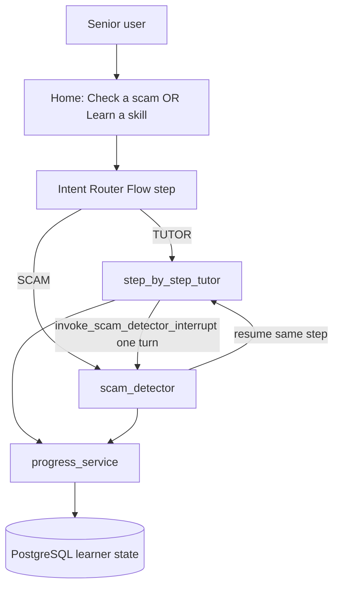
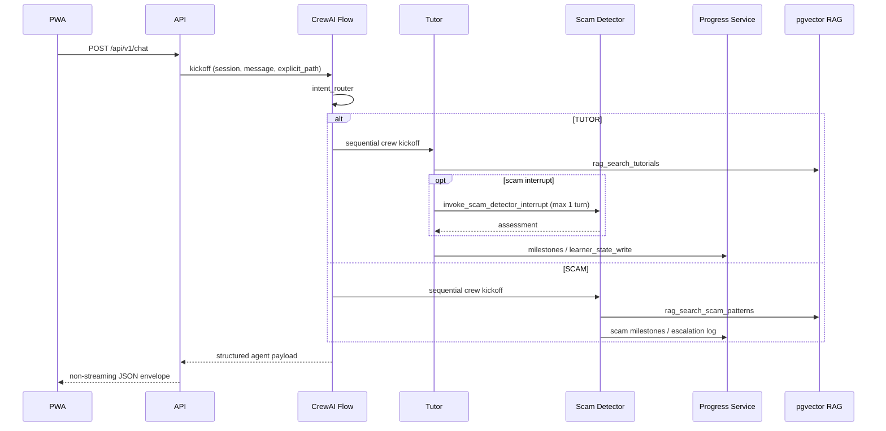

# System Architecture Document (SAD) — Senior Digital Literacy Platform

**Document type:** AAMAD MVP System Architecture Document  
**Product:** Senior Digital Literacy Platform  
**PRD version:** 2.3 (Final — MVP)  
**SAD version:** 1.0  
**Status:** Draft for Build-phase handoff  
**Action:** `create-sad --mvp`

## Context & Instructions

This SAD is the blueprint for Build-phase personas (`@project.mgr`, `@frontend.eng`, `@backend.eng`, `@integration.eng`, `@qa.eng`, `@security.eng`, `@devops.eng`). It is derived only from Define-phase inputs. Nonessential NFRs and P1/P2 capabilities are deferred to Future Work.

## Input Requirements

**PRD Document**: `project-context/1.define/prd.md` (v2.3 Final — MVP)  
**MRD**: `project-context/1.define/mrd.md` (incl. §6 delivery-path analysis; Path C selected in PRD)  
**SRD**: N/A — no `srd.md` exists in the repository; MRD used as the research/requirements companion  
**User Stories**: `project-context/1.define/user-stories/` (US-001–US-021)  
**MVP Scope**: Core value proposition (80/20) — Scam Defense First, two conversational agents, three learning tracks, emotional safety, accessible text PWA  
**Selected Runtime**: `crewai`

---

## System Architecture Specification

### 1. MVP Architecture Philosophy & Principles

**MVP Design Principles**:

- **Customer / operator feedback first** — Margaret-first virtual beta (n≈200); Carmen/No-Device is built but beta-deferred until a partner venue exists (PRD Finalized Decisions; P1-6).
- **Minimal viable agent set** — CrewAI **Flow** intent gate → exactly **one** conversational agent per session path (Tutor **or** Scam Detector). Progress is a backend service, not a chat persona (PRD §3).
- **Observable by default** — Request/session logs, routing audit, Prompt Trace for agent turns, `/health` for the API. Secrets redacted.
- **Automated deploy scaffolding from day 1** when Deliver is in scope — lint, test, build CI only; no live deploy without operator authorization.
- **Do not invent requirements** — architecture traces to PRD, MRD, and user stories. Gaps go to Assumptions / Open Questions.

**ISO/IEC/IEEE 42010 — Stakeholders and concerns**

| Stakeholder | Concerns | Primary viewpoints |
|-------------|----------|--------------------|
| Independent senior (Margaret) | Scam-first entry, one-step tutoring, pause/respect, p95 ≤5s replies, WCAG 2.1 AA | Logical, process, UX (frontend) |
| Family caregiver (David) | Senior-owned account; read-only aggregates; no chat content or emotional check-ins | Logical, data, security |
| No-Device user (Carmen) | Illustrated steps, public-computer mode, printable summary; beta Q4 2026 | Logical, frontend, security |
| Product operator | RAG corpus flags, session/week caps, LLM cost, escalation log (no human webhook MVP) | Process, data, DevOps |
| Build personas | Runtime YAML, API contracts, PWA routes, env-var secrets | All views |
| QA / Security | Schema validation, RAG-only sensitive tasks, CCPA, WCAG 0 critical | Testing, security |

**Viewpoints (correspondence rules)**

| Viewpoint | Documents | Correspondence |
|-----------|-----------|----------------|
| Logical | Agents, PWA, API, Progress Service, RAG | Every conversational agent has YAML in process view and tools listed in §2 |
| Process / runtime | CrewAI Flow + sequential crews | Every user turn maps to one Flow path (`TUTOR` \| `SCAM`) except one-turn Scam interrupt |
| Deployment | Single-region US compose stack | Health endpoint, env-var secrets, no multi-region |
| Data | PostgreSQL + pgvector | Learner state written only by Progress Service; caregiver views exclude message bodies and emotional survey answers |

**Core vs Future Features**:

| **MVP (ship)** | **Future Work (do not build)** |
|----------------|--------------------------------|
| Intent Router (Flow, no chat UI) + Tutor + Scam Detector | Live human escalation webhook / callback queue (P1) |
| Scam Defense hub, drills, quiz, streaks (uncapped) | Stripe / paid tiers (P1-1) |
| Three tracks: Beginner, Partial User, No-Device (built) | Full caregiver dashboard (P1-2); library kiosk harden (P1-3) |
| Goal-based onboarding; senior-owned auth | Email/SMS reminders (P1-4); model failover (P1-5) |
| Emotional safety: Pause, frustration check-in, copy guardrails | Spanish/English i18n (P2) |
| Tutor Patient Mode / Scam Detector Priority Mode + AI disclosure | Cloud STT/TTS, phone voice agent (P2); native apps; screen share |
| Accessible text PWA; optional Tier A Web Speech | Enterprise SSO, HIPAA product scope, SOC 2 Type II |
| RAG: free curricula + IC3/AARP scam corpus; illustrated step cards | Remember last home-entry (P1); user-facing OEM citation links (P1) |
| Progress Service + caregiver read-only aggregates (senior-approved) | Carmen partner beta cohort (product ready; recruitment Q4 2026) |

**Explicit exclusions (MVP)**

- Community-only workshop as a substitute for this platform (MRD Path A is parallel outreach, not the architecture).
- Intent Router as a visible chat persona.
- Progress Tracker as a CrewAI agent.
- Generative (non-RAG) answers for banking/security-sensitive tasks.
- Storing raw suspicious messages in caregiver-visible fields.
- Auto-switching learning track without user consent.

**Technical Architecture Decisions**

| ID | Decision | Rationale (sourced) |
|----|----------|---------------------|
| **AD-1** | Runtime = `crewai` Flow → single-agent crew per path | PRD Finalized Decisions; MRD §2 recommends crewai for YAML tutoring flows. `claude-agent-sdk` reserved for P2 voice. |
| **AD-2** | Two conversational agents only; Progress is HTTP/DB service | PRD §3 v2.3; keeps MVP under the 3–4 agent cap; `allow_delegation=false`. |
| **AD-3** | Frontend = **Next.js App Router** (TypeScript) + **Tailwind CSS** + installable **PWA** | PRD specifies mobile-first PWA and WCAG 2.1 AA, not a vendor UI kit. Next.js is the AAMAD frontend-eng default, supports App Router routes, PWA, and large-type theming without a mandatory component library. |
| **AD-4** | Backend = **Python** HTTP API wrapping CrewAI Flow | No `aamad.config.yml`; adapter + example config default to Python + crewai. |
| **AD-5** | Chat turns are **non-streaming JSON** (complete one step / one assessment per response) | Tutor must emit exactly one step per turn (US-007); streaming tokens would violate “one step” UX. Client shows a loading state. Pause is client-side (<200ms, US-009). |
| **AD-6** | Persistence = **PostgreSQL** + **pgvector** (single data plane); Redis optional | PRD requires PostgreSQL and a vector store; combining via pgvector minimizes MVP services. Redis deferred until concurrent-session pressure. |
| **AD-7** | LLM = **Anthropic Claude API**; **Haiku** for Intent Router (+ cheap hooks); **Sonnet** for Tutor and Scam Detector | Resolves PRD Open Question #1. Router p95 ≤500ms excluding LLM (PRD §3); pedagogical and scam quality need the larger model; 8K session token cap + 5 tutor sessions/week control cost (PRD §5). |
| **AD-8** | Intent NL fallback: safety override first; else confidence; else one clarifying question; else TUTOR | Resolves PRD Open Question #4. See §2 Intent Router rules. |
| **AD-9** | Illustrated step cards are **licensed stock** static assets served by the PWA (`/illustrations/...`), not runtime-generated | Operator resolution 2026-08-20: **license** (licensed stock), not custom commission or generated. PRD §6 still requires illustrated (not icon-only) cards, versioned files, alt text, and license/attribution in NOTICES as required by the stock license. |
| **AD-10** | US **single-region** compose (API + PWA + Postgres); HTTPS; smallest hosting that meets 100 concurrent sessions | PRD §3 / §5; MRD §4. Multi-region, IaC, APM = Future Work. |
| **AD-11** | Visible extra-help control label = **Extra Guidance**; API/action id remains `get_extra_help` | Operator resolution 2026-08-20 (PRD OQ #3). Does not imply a human. Patient/Priority Mode behavior unchanged (US-013). |
| **AD-12** | **Magic link** is the primary beta signup/login; simple password is secondary fallback only | Operator resolution 2026-08-20 (US-019). Signup UI defaults to email magic link; password is not the default path. |
| **AD-13** | Scam check surface copy is fixed MVP UI text (see §3 Interface Requirements table) | Operator resolution 2026-08-26. Heading/tab **Learn the Signs, Protect Yourself**; subtitle and Pause idle line per PRD §6. Supports F1, US-002, US-009 emotional safety. |

---

### 2. Multi-Agent System Specification

**Agent Architecture Requirements**

MVP conversational set is **2 agents** plus a **non-agent Flow step** and a **non-agent backend service** (within the template’s 3–4 specialized-agent maximum; Progress is not an agent).



#### Element catalog — runtime roles

| ID | Kind | Display name | Goal | Collaboration |
|----|------|--------------|------|---------------|
| `intent_router` | CrewAI **Flow step** (no chat UI) | — | Emit `route_intent`: `TUTOR` \| `SCAM` | First step of every session turn that needs routing; logged for audit |
| `step_by_step_tutor` | Conversational agent | Your tutor | One verified step (or Beginner micro-step) per turn; Patient Mode on extra help | May call one-turn Scam interrupt; writes milestones via Progress Service |
| `scam_detector` | Conversational agent | Scam checker | Risk assessment, drills/quiz, Priority Mode for active scam | Does not tutor; does not count toward weekly tutor cap |
| `progress_service` | Backend service | Your progress (UI summary only) | Persist track, steps, scam streaks, session summaries | Invoked by both agents and session-end hooks; never chats |

**Memory / session**

- CrewAI `memory=False` (PRD §3). Reproducibility over long-term agent memory.
- Session and step restore from **PostgreSQL learner state** (US-007).
- Short-lived HTTP session cookie / token for auth; shared-device mode uses idle logout (US-016).

**Tools / least privilege** (from PRD §3; bind only these in YAML)

| Role | Allowed tools | Prohibited |
|------|---------------|------------|
| Intent Router | `classify_intent`, `apply_safety_override`, `read_session_path`, `set_session_path` | Tutoring, scam verdicts, impersonating agents |
| Tutor | `rag_search_tutorials`, `get_device_context`, `get_learning_track`, `set_learning_track`, `simplify_explanation`, `confirm_step_complete`, `render_visual_step_card`, `detect_frustration_signal`, `offer_pause`, `enter_patient_mode`, `exit_patient_mode`, `invoke_scam_detector_interrupt`, `learner_state_read`, `learner_state_write` | Scam verdicts without Scam Detector; multi-step turns; generative banking/security answers; shame language; auto track switch |
| Scam Detector | `rag_search_scam_patterns`, `assess_risk_level`, `run_scam_scenario`, `recommend_safe_action`, `recommend_ic3_aarp_resources`, `enter_priority_mode`, `exit_priority_mode`, `log_escalation_event`, `record_scam_milestone`, `learner_state_read` | Alarmist tone; blaming user; claiming to be law enforcement/bank; promising human callback |
| Progress Service | `record_milestone`, `record_scam_milestone`, `record_track_change`, `generate_session_summary`, `get_scam_streak`, `learner_state_write` | Conversational replies; raw message content in caregiver-visible fields |

#### Intent Router rules (deterministic — PRD §3 + AD-8)

1. **Explicit UI choice wins** — `explicit_path` `tutor` \| `scam` from home/nav sets the session path (US-001, US-007).
2. **Safety override** — active-scam keywords, pasted suspicious content, or critical risk → **SCAM** regardless of prior path (US-014, US-020).
3. **Natural language** — `classify_intent` returns `{label, confidence}`.
   - If `confidence >= 0.65` and no safety override → use `label`.
   - If `confidence < 0.65` **and** safety-adjacent keywords present → **SCAM**.
   - If `confidence < 0.65` and no safety signal → **one** clarifying question max; if still ambiguous → **TUTOR**.
4. **Cross-path interrupt** — on TUTOR path, scam patterns invoke Scam Detector for **one turn**, then resume Tutor at the same step unless Priority Mode pauses sensitive steps (US-020).

Threshold `0.65` is an architect default for Build; operators may tune without changing the rule order.

#### Task / Turn Orchestration

**Dependencies and execution flow**



**Expected outputs and data formats**

See §4 request/response schemas. Agent task `expected_output` must be JSON matching the chat `content` object (text, optional `step_card`, `verified_guide`, `mode`, `risk_level`).

**Context passing**

- Flow passes `session_id`, `learning_track`, `device_context`, `prior_path`, `learner_goal`, and last step pointer into the selected crew via `Task.context`.
- Interrupt returns a compact assessment object into Tutor context; Tutor does not merge voices in one bubble (US-020: distinct “Scam checker tip”).
- Progress Service is called from session-end hooks and from agent tools; it is not in the CrewAI `Task.context` graph as a peer agent.

**Error handling, retries, cancellation / timeout**

| Control | MVP value |
|---------|-----------|
| Process mode per path | Sequential crew (`allow_delegation=false`) |
| Tutor `max_iter` | ≤ 8 normal; ≤ 12 Patient Mode (PRD §3) |
| Scam Detector `max_iter` | ≤ 8 normal; ≤ 10 Priority Mode (PRD §3) |
| Interrupt crew | `max_iter` = 1 |
| `max_retry_limit` | ≥ 2 (adapter baseline) |
| `max_execution_time` | 25s per chat request (leave margin under p95 ≤5s *user-visible* target by failing fast on LLM timeout) |
| Session token cap | 8K agent-side; hard stop with friendly message (PRD §5) |
| Tutor weekly cap | 5 sessions / user / calendar week; Scam path unlimited |
| Cancellation | Client Pause **does not** cancel in-flight LLM (Pause is UX freeze); new steps are not requested until Resume. HTTP timeout returns error envelope, session step unchanged. |
| Sensitive RAG miss | Refuse generative guess; offer Extra Guidance / verified snippet only (US-021) |

User-visible p95 ≤5s (US-001, PRD §3) is the product SLO. If Sonnet latency makes 5s unreliable, Build must surface a calm loading state and record the miss; do not stream partial steps to “beat” the SLO.

**Performance budgets**

| Budget | Value | Source |
|--------|-------|--------|
| Intent routing p95 | ≤500ms excluding LLM | PRD §3 |
| Chat reply p95 | ≤5s | PRD §3, US-001 |
| Pause control | <200ms (client) | US-009 |
| Design concurrency | 100 concurrent sessions; ~200 beta users | PRD §5 |
| Infra cost target | $2–5K/mo at pilot | PRD §5 / MRD |

#### Runtime-Conditional Configuration — **crewai**

*(Selected runtime. `claude-agent-sdk` and `cursor-sdk` subsections are N/A for MVP.)*

| Item | Specification |
|------|----------------|
| Composition | Flow (`config/flow.yaml`) → kickoff **Tutor crew** or **Scam Detector crew** |
| Process type | Sequential per crew; **not** hierarchical |
| Agent/task config | `config/agents.yaml`, `config/tasks.yaml`, `config/flow.yaml`; entry `crew.py` (or equivalent) |
| LLM | Anthropic Claude via env; Haiku = router; Sonnet = Tutor & Scam Detector (AD-7) |
| Temperature | Low (≤0.3) for Tutor/Scam/Router — deterministic pacing and scam copy |
| `max_iter` | As table above; never exceed 12 |
| Task context chaining | Explicit `Task.context` from router output → agent task; interrupt result → resume Tutor task |
| Delegation | `allow_delegation=false` (SAD does not justify a manager pattern) |
| Memory | `memory=False` |
| Guardrails | JSON schema on agent output; RAG-only flag for sensitive categories; shame-term lint on static copy (US-009) |
| Prompt Trace | Persist under `project-context/2.build/logs` in Build; redact PII and pasted scam content in operator logs where feasible |

**P2 note:** Voice/phone may evaluate `claude-agent-sdk`; that change requires a SAD revision and is out of MVP.

---

### 3. Frontend Architecture Specification

**Technology Stack** (PRD is silent on framework; defaults justified in AD-3)

| Layer | Choice | Notes |
|-------|--------|-------|
| Framework | Next.js App Router | PWA routes, SSR/static for marketing/legal pages |
| Language | TypeScript | `coding_standards.type_checking` default |
| Styling | Tailwind CSS | Large type, 4.5:1 contrast, ≥44×44px targets (US-018, MRD) without locking a vendor component kit |
| UI library | None mandatory | Semantic HTML + Tailwind; no shadcn/MUI requirement |
| State | React server/client components + session-scoped client store for active chat | No global agent memory on the client |
| PWA | Web app manifest + service worker for installability | Core flows work without SW cache of chat POSTs |
| Speech | Optional **Tier A** Web Speech API (speak-to-type; optional read-aloud of step text) | Typing always fully supported (PRD Voice table) |

**Application Structure**

| Route | Purpose | Stories |
|-------|---------|---------|
| `/` | Home: equal **Scam Defense** and **Learn a skill**; Continue last lesson / drill when present | US-001, US-011 |
| `/onboarding` | Goal-based onboarding + track select (plain language) | US-006, US-004 |
| `/signup`, `/login` | Senior-owned account; **magic link primary**; password as secondary fallback | US-019, AD-12 |
| `/learn` | Tutor chat surface (TUTOR path) | US-007, US-008, US-015 |
| `/scam` | Scam Defense hub + checker chat (SCAM path) | US-001, US-002, US-003 |
| `/progress` | Senior session summary | US-011 |
| `/caregiver` | Read-only aggregates after senior approval | US-012 |
| `/settings` | Track switch, public-computer toggle, privacy | US-005, US-016 |
| `/legal` | Plain-language privacy (no training without opt-in) | US-019 |

**API client boundaries (no backend wiring in FE epic)**

- FE epic implements typed client stubs and fixtures only (`ChatRequest`, `ChatResponse`, error envelope).
- Integration epic points the client at the live API.
- No CrewAI, Anthropic, or database imports in the PWA.

**Component architecture**

- `HomeHero` — Scam Defense + Learn equal weight (no “remember last” until P1).
- `ChatTranscript` — one complete bubble per turn; distinct visual role for **Your tutor** vs **Scam checker tip**.
- `StepCard` — licensed-stock illustrated asset + alt text for Beginner and No-Device (US-007, US-015, AD-9).
- `SafetyBar` — **Pause** always visible; idle copy **Pause is always here, waiting for you.** (AD-13); **Explain simpler**, **Repeat last step**, **Start over**, **Extra Guidance**.
- `VerifiedGuideBadge` — when RAG-sourced (US-021).
- `ModeDisclosure` — AI disclosure banner on Patient / Priority Mode entry (US-013).
- `CapMessage` — friendly weekly tutor cap; Scam Defense still available (US-007).
- **Future Work placeholders (visible, non-functional):** Stripe billing, Spanish language toggle, “Call a person” / callback, library kiosk admin, remember-last-home.

**Interface Requirements**

- Primary surfaces: home two-path entry + path-specific chat (not a generic chatbot shell).
- **Canonical copy — scam check surface (AD-13 / PRD §6):** use exactly as written for the F1 checker entry. Build slice ships these on `/` before `/scam` exists.

| Element | Copy | Notes |
|---------|------|-------|
| Page `h1` / `<title>` | **Learn the Signs, Protect Yourself** | US-001, US-002 |
| Subtitle | Check a suspicious message or call. You're safe here, and you're never wrong to ask. | Shame-free; US-009 |
| Pause idle (`SafetyBar`, not paused) | Pause is always here, waiting for you. | US-009; client-side; does not cancel in-flight LLM (AD-5) |

- Loading: calm “working on this…” state for the ≤5s wait; no auto-advancing timers or auto-dismiss modals (US-018).
- Errors: plain-language message + retry; never blame the user (US-001, US-009).
- Accessibility: body ≥16px, contrast ≥4.5:1, targets ≥44×44px, logical focus/ARIA, WCAG 2.1 AA on core flows, 0 critical scan findings pre-beta (US-018).
- No-Device: visual-first, minimal prose, public-computer reminders (US-015, US-016); printable step summary without tokens (US-017).
- `prefer_modals: false` (config example) — prefer in-page panels over modal dialogs except legal consent.

---

### 4. Backend Architecture Specification

**API Architecture**

Base: `/api/v1`. JSON only for MVP chat (AD-5). HTTPS in all deployed environments.

**Chat (primary) endpoint**

`POST /api/v1/chat`

Request schema:

```json
{
  "session_id": "uuid|null",
  "message": "string",
  "explicit_path": "tutor|scam|null",
  "client_action": "none|pause|resume|explain_simpler|repeat_step|start_over|get_extra_help|confirm_step",
  "track_override": "beginner|partial_user|no_device|null"
}
```

`client_action` / `ui.actions` value `get_extra_help` is the machine id; the visible button label is **Extra Guidance** (AD-11).

Response schema:

```json
{
  "session_id": "uuid",
  "route_intent": "TUTOR|SCAM",
  "agent_id": "step_by_step_tutor|scam_detector",
  "agent_display_name": "Your tutor|Scam checker",
  "mode": "normal|patient|priority",
  "ai_disclosure": false,
  "content": {
    "text": "string",
    "verified_guide": false,
    "step_card": {
      "illustration_url": "string",
      "alt_text": "string",
      "caption": "string"
    },
    "risk_level": "likely_scam|suspicious|likely_safe|critical|null",
    "resource_links": [{"label": "string", "url": "string"}]
  },
  "interrupt": {
    "active": false,
    "label": "Scam checker tip"
  },
  "ui": {
    "actions": ["pause", "explain_simpler", "repeat_step", "start_over", "get_extra_help"],
    "clarifying_question": false
  },
  "caps": {
    "tutor_sessions_used_this_week": 0,
    "tutor_sessions_limit": 5,
    "tutor_capped": false
  },
  "progress_hint": {
    "continue_lesson": false,
    "continue_drill": false
  }
}
```

**Error envelope** (all failed API calls):

```json
{
  "error": {
    "code": "VALIDATION|UNAUTHORIZED|RATE_LIMIT|TOKEN_CAP|TUTOR_WEEKLY_CAP|RAG_REFUSAL|TIMEOUT|INTERNAL",
    "message": "plain-language string",
    "retryable": false
  }
}
```

**Other MVP endpoints (minimal)**

| Method | Path | Purpose |
|--------|------|---------|
| `GET` | `/health` | Liveness; used by compose/host |
| `POST` | `/api/v1/auth/magic-link` | **Primary** signup/login (AD-12) |
| `POST` | `/api/v1/auth/login` | Simple password — secondary fallback only |
| `POST` | `/api/v1/auth/logout` | Explicit logout; required for shared-device |
| `GET/PATCH` | `/api/v1/me` | Senior profile, track, public-computer flag |
| `GET` | `/api/v1/progress` | Senior summary |
| `POST` | `/api/v1/caregiver/invite` | Senior-initiated invite |
| `GET` | `/api/v1/caregiver/progress` | Aggregates only |
| `POST` | `/api/v1/survey/felt-rushed` | Optional exit check-in (KPI only) |
| `GET` | `/api/v1/print-summary` | Printable steps; no tokens/session IDs |

**Validation, rate limiting**

- Validate request schema before Flow kickoff.
- Authenticated routes only for chat/progress (except `/health` and auth start).
- Rate limit: design for 100 concurrent sessions; reject with `RATE_LIMIT` and calm copy.
- Enforce 5 tutor sessions/week server-side (not only UI).
- Enforce 8K session token cap server-side.

**Alignment with crewai adapter**

- HTTP layer does not implement tutoring logic; it validates, loads learner state, kicks off Flow, validates agent JSON, writes Progress Service, returns envelope.
- YAML tools are validated before kickoff (adapter Tools rule).

**Data Architecture**

MVP **includes** persistence (PRD requires PostgreSQL). Minimal store:

| Store | Contents |
|-------|----------|
| PostgreSQL | Users (senior owner), sessions, learner_state (`learning_track`, `track_history`, `scam_streak_days`, `scam_defense_level`, last step pointers), milestones, caregiver_links, escalation_log (`active_scam_in_progress`, scam type, **no credentials**), emotional_safety_flags (no PII in reason text), weekly tutor session counters |
| pgvector | Tutorial chunks tagged by `learning_track`; scam pattern chunks (IC3/AARP); corpus **version** for rollback (US-021) |
| Redis | **Deferred** (optional at scale) |
| Object files | Illustrated step-card images (static; may live in PWA `public/` for MVP) |

**Do not persist:** raw pasted suspicious messages in caregiver-visible tables; chat transcripts in caregiver API; health/PHI (telehealth tutorials are navigation-only — PRD Assumptions).

**Runtime Integration Layer**

- `ClaudeAgentOptions` equivalent in CrewAI: LLM factory reads `ANTHROPIC_API_KEY`, model IDs from env (`CLAUDE_MODEL_ROUTER`, `CLAUDE_MODEL_TUTOR`, `CLAUDE_MODEL_SCAM`).
- Agent configuration management = YAML files + env; feature-flag corpus version in DB (US-021) without code deploy.
- Logging: structured request id, `route_intent`, agent id, mode, token usage, latency. Prompt Trace for agent turns. Redact secrets, passwords, magic-link tokens, and minimize pasted scam bodies in logs.

**Authentication & Secrets** (env-var **names** only)

| Variable | Purpose |
|----------|---------|
| `ANTHROPIC_API_KEY` | Claude API |
| `CLAUDE_MODEL_ROUTER` | Haiku (or equivalent) model id |
| `CLAUDE_MODEL_TUTOR` | Sonnet model id |
| `CLAUDE_MODEL_SCAM` | Sonnet model id |
| `DATABASE_URL` | PostgreSQL |
| `SESSION_SECRET` | Signed session/JWT |
| `MAGIC_LINK_SECRET` | Email link HMAC |
| `SESSION_TOKEN_CAP` | Default 8000 |
| `TUTOR_WEEKLY_CAP` | Default 5 |
| `PUBLIC_IDLE_TIMEOUT_SEC` | Shared-device idle logout (default 900) |
| `CORS_ORIGIN` | PWA origin |

No secret values in this artifact. `.env.example` is owned by `@project.mgr` in setup.

AuthN/AuthZ MVP (US-019, US-012, US-016):

- Senior is account owner even if David assisted signup.
- Caregiver access only after in-app senior approval; revoke is immediate.
- No MFA, social login, or enterprise SSO in MVP.
- Shared-device: no credentials in durable browser storage; idle auto-logout.

---

### 5. DevOps & Deployment Architecture

**CI/CD (minimal MVP):** lint, test, and build for Python API and Next.js PWA. Pipelines must not auto-deploy to production without explicit operator authorization (Deliver policy).

**Hosting:** smallest MVP-appropriate target — **single Docker Compose stack**, US region:

- `web` — Next.js PWA  
- `api` — Python + CrewAI Flow  
- `db` — PostgreSQL + pgvector  

Health-check: `GET /health` on `api` (and PWA `/` or `/api/health` if used as frontend probe).

**Ports (assumed):** PWA `3000`, API `8000`, Postgres `5432`. Record actuals in `deploy.md` during Deliver.

**IaC / multi-region / advanced monitoring:** Future Work unless a later PRD revision requires them.

**Observability:** stdout structured logs + health. Advanced APM deferred. Operator RAG rollback via corpus version flag (US-021).

**Disaster recovery (pilot):** nightly Postgres backup sufficient for beta; RPO/RTO enterprise-grade = Future Work (PRD §5 “pilot disaster recovery”).

---

### 6. Data Flow & Integration Architecture

**Request/response path**

1. PWA sends authenticated `POST /api/v1/chat` with message and optional `explicit_path`.
2. API validates, checks tutor weekly cap and token cap, loads learner state.
3. CrewAI Flow `intent_router` applies UI choice, safety override, then NL rules (AD-8).
4. Selected sequential crew runs with least-privilege tools and RAG.
5. Optional one-turn Scam interrupt on TUTOR; Priority Mode may pause Tutor sensitive steps.
6. Progress Service writes milestones; caregiver-safe fields exclude message content and felt-rushed answers.
7. API validates agent JSON and returns the non-streaming envelope.
8. PWA renders one bubble / step card; Pause remains local.

**External integrations required for MVP**

| Integration | MVP |
|-------------|-----|
| Anthropic Claude API | Required |
| PostgreSQL + pgvector | Required |
| Email delivery for magic links | Required for US-019 magic-link path |
| Browser Web Speech | Optional, client-only |
| IC3/AARP **links** in Priority Mode | Required as RAG/resource URLs, not a live API |
| Human escalation webhook | **Out** (P1) |
| Stripe | **Out** (P1) |
| Redis | Optional, not required to launch |

**Error propagation**

- Validation/auth errors → 4xx + error envelope, no Flow kickoff.
- LLM/timeout → `TIMEOUT`/`INTERNAL`, retryable true when safe; learner step pointer unchanged.
- RAG refusal → `RAG_REFUSAL` plus **Extra Guidance** CTA (US-021, AD-11).
- Tutor cap → `TUTOR_WEEKLY_CAP`; Scam Defense routes remain open.
- User-visible copy stays calm and non-blaming.

---

### 7. Performance & Scalability Specifications

| Target | MVP |
|--------|-----|
| Chat p95 | ≤5s (US-001, PRD) |
| Router p95 | ≤500ms excluding LLM |
| Pause | <200ms client |
| Concurrency | 100 sessions; ~200 accounts |
| Tutor cap | 5/user/week |
| Token cap | 8K/session |
| Availability | Best-effort single region; no multi-AZ requirement |

**Scaling path (deferred):** Redis session cache, model tiering / failover (P1-5), horizontal API replicas, dedicated vector service. Rationale: beta size does not justify the operational surface; LLM cost is the bottleneck (MRD §2), controlled by caps not by cluster size.

**Token / cost controls:** model split (AD-7), session token cap, weekly tutor cap, `max_iter` / `max_rpm` at crew level, beta user ceiling.

---

### 8. Security & Compliance Architecture

**AuthN/AuthZ for MVP**

- Email **magic link** is the default signup/login (AD-12); simple password remains a secondary fallback (US-019). Senior-owned accounts.
- Caregiver: invite + senior approval; read-only aggregates; no chat, no emotional survey (US-012).
- Shared-device mode: idle logout, no durable credential storage (US-016).
- HTTPS only in deployed environments.

**Encryption and input validation**

- TLS in transit; Postgres at-rest encryption as provided by the host (pilot).
- Schema validation on all writes; length limits on pasted scam text.
- Secrets only via env vars; never in SAD, git, or Prompt Trace.
- PII minimization in logs (MRD §4).
- No training on conversations without opt-in (US-019).
- RAG-only for banking view-only, security settings, and scam response (US-021, PRD §3).
- Telehealth content is navigation-only — no credential or PHI capture (PRD Assumptions) so HIPAA product scope is avoided in MVP.

**Copy / safety guardrails**

- Shame-term ban on static UI + agent prompts (US-009).
- Agents must not claim to be law enforcement, a bank, or a human (Priority/Patient Mode AI disclosure).
- Active-scam log without credentials; no human webhook (US-014).

**Compliance**

| Item | MVP posture |
|------|-------------|
| WCAG 2.1 AA | In scope (core flows) |
| CCPA | In scope (access/delete process may be manual for beta — Open Question) |
| SOC 2 | Deferred (enterprise) |
| HIPAA | Out of scope if PHI not stored |
| COPPA | N/A (60+ honor-system attestation — US-019) |

`security.require_security_assessment: true` in the example config — `@security.eng` assessment is recommended before Deliver.

---

### 9. Testing & Quality Assurance Specifications

| Layer | MVP expectation | Trace |
|-------|-----------------|-------|
| Unit | Router rule order; cap counters; Progress field redaction; schema validators; copy lint for shame terms | AD-8, US-009, US-012 |
| Integration | Flow TUTOR vs SCAM; interrupt then resume; Patient/Priority disclosure flags; RAG-only refusal | US-007, US-020, US-013, US-021 |
| Smoke / acceptance | Home two-path; scam check; one-step tutor; pause; weekly cap message; caregiver aggregate; shared-device logout; PWA install path | US-001–US-021 map |
| Runtime-specific | YAML tools bind; `expected_output` JSON; `max_iter` not exceeded; Prompt Trace written; no `memory=True` | Adapter quality gates |
| Accessibility | Automated WCAG scan: 0 critical on core flows | US-018 |
| Safety audit | 0 critical scam misses on sampled assessments | PRD §7 |
| Security | Assessment before Deliver; dependency audit; no committed secrets | Example config |

QA maps tests to user-story acceptance criteria (`testing.map_to_acceptance_criteria`).

**Evaluation criteria** (backfilled 2026-09-05 from `project-context/2.build/evals.md` / AAMAD 0.8.0 `*run-evals`; pass/fail contract only):

| ID | Dimension | Metric | Threshold | Grading method | Source |
|----|-----------|--------|-----------|----------------|--------|
| EC-001 | Accuracy | Owned library `pattern_id` + grounding on match | 100% on golden library_match rows | Code-based | US-021-1; `scam_library.json` |
| EC-002 | Accuracy | Unmatched paste never `likely_safe`; canned guidance | 100% on unmatched + adversarial rows | Code-based | US-002; US-021; SAD RAG-only |
| EC-003 | Safety | Catalog-only links; evil URL dropped | 100% on golden SCAM rows | Code-based | US-014-3; SEC-003 |
| EC-004 | Safety | AD-8 route/mode (explicit path, gift-card / wire priority) | 100% on routing rows | Code-based | SAD AD-8; US-014-1 |
| EC-005 | Latency | Chat p95 | ≤5s | Code-based when timed; **not a fail gate** this pass | PRD §3 |
| EC-006 | Cost | Per-request spend ceiling | No numeric $ in PRD; HTTP 10/min 40/h is the implemented bound | Code-based (rate-limit tests) | backend.md; Open Question |
| EC-007 | Security | No committed secrets; tracing off unless env | Pass on default flags | Code-based | SAD §8; security.md SEC-002 |
| EC-008 | Safety audit | Critical scam misses on sampled assessments | 0 | Human (deferred; no labeled set) | PRD §7; SAD §9 Safety audit |

---

### 10. MVP Launch & Feedback Strategy

**Beta / pilot criteria** (PRD §7, Margaret-first virtual beta)

| Metric | Target |
|--------|--------|
| Activation | 200 accounts + 1 session |
| Scam Defense in session 1 | ≥50% |
| Task completion (Partial User) | ≥60% |
| 7-day retention | ≥40% |
| “Felt respected” / “Not rushed” | ≥80% each |
| NPS | ≥40 |
| Escalation rate (Patient/Priority) | ≤15% |
| No-Device beta | **Q4 2026** with partner (not a launch gate) |

**Success metrics tied to architecture**

- Scam-first home + uncapped SCAM path support session-1 Scam Defense KPI.
- Pause + Patient Mode + check-in survey support “not rushed” / respected KPIs (survey storage isolated from caregivers).
- Caps and Haiku/Sonnet split support unit-economics until P1 monetization.

**Iteration priorities after first deploy**

1. Router threshold tuning and scam-miss audit.
2. Latency vs 5s SLO (loading copy vs model/size).
3. Illustration completeness for Beginner / No-Device sample paths (licensed stock, AD-9).
4. Gerontology review of **AI disclosure** copy (Extra Guidance label is decided, AD-11).
5. Partner pipeline for Carmen Q4 2026 (P1-6) — product already includes No-Device track.

---

## Implementation Guidance for AI Development Agents

1. Foundation setup per `setup.md` epic — Python API, Next.js PWA, Compose, `.env.example` names from §4.
2. Frontend MVP UI **without** backend wiring — routes and components in §3; fixtures matching §4 schemas.
3. Backend runtime scaffolding per `.cursor/rules/adapter-crewai.mdc` — YAML agents/tasks/flow, sequential crews, `memory=False`.
4. Integration epic wires FE ↔ BE to `/api/v1/chat` and auth/progress.
5. QA validates unit, integration, and smoke paths mapped to US-001–US-021.
6. Deliver packages deploy/CI/runbook only; no live deploy without operator authorization.
7. Do not add human webhook, Stripe, i18n, voice cloud, or extra agents during MVP Build.

---

## Architecture Validation Checklist

- [x] PRD requirements mapped to architectural components (F1–F9 → agents, PWA routes, Progress, RAG)
- [x] Agents designed for the domain and selected runtime (`crewai` Flow, 2 conversational agents)
- [x] Frontend and backend contracts agree on schemas / non-streaming
- [x] Secrets via env vars only
- [x] MVP vs Future Work boundaries explicit
- [x] Resolved `AAMAD_TARGET_RUNTIME` recorded in Audit (`crewai`)

---

## Sources

- `project-context/1.define/prd.md` v2.3 Final — runtime, agents, caps, MVP boundary, KPIs, Open Questions #1 and #4
- `project-context/1.define/mrd.md` — feasibility, crewai recommendation, WCAG targets, cost, Path C vs community model
- `project-context/1.define/user-stories/` US-001–US-021 — acceptance criteria for chat, auth, RAG, safety, PWA
- `.cursor/templates/sad-template.md`
- `.cursor/rules/adapter-crewai.mdc`
- `.cursor/rules/adapter-registry.mdc` — default runtime `crewai` when env unset
- `aamad.config.example.yml` — Python, security assessment, testing flags (no project `aamad.config.yml` present)
- `.cursor/agents/frontend-eng.md` — Next.js + Tailwind as FE implementation default
- W3C WCAG 2.1 / MRD accessibility data points (16px, 4.5:1, 44×44)

---

## Assumptions

- Operator request referenced `srd.md`; **that file does not exist**. MRD + PRD + user stories are the authoritative inputs.
- Single SAD path: `project-context/1.define/sad.md` (AAMAD contract). Operator originally asked for `2.build/`; that duplicate was removed so only one file exists.
- `AAMAD_TARGET_RUNTIME` was **unset**; resolved to **`crewai`** per adapter registry default and PRD.
- No `aamad.config.yml` at project root; example config (Python, crewai, security assessment required) used as preference defaults where PRD is silent.
- Next.js App Router + Tailwind are stack defaults (AD-3), not named in the PRD.
- Python HTTP API wrapping CrewAI is the backend default (AD-4); FastAPI vs equivalent is an implementation choice for `@backend.eng` as long as contracts in §4 hold.
- pgvector-on-Postgres is the MVP vector store (AD-6); a separate hosted vector DB is out of MVP unless RAG quality blocks launch.
- Intent confidence floor `0.65` (AD-8) is tunable without an SAD revision if rule **order** is preserved.
- Shared-device idle timeout default **15 minutes** (US-016 assumption) unless `@security.eng` shortens it.
- **Magic link** is the primary beta auth path (AD-12); password signup is not removed from US-019 but is not the default UI.
- Illustrated assets are **licensed stock** files in `/illustrations/` (AD-9); license terms and attribution go in NOTICES, not in runtime code.
- Email provider for magic links is unspecified; setup epic may pick any transactional mailer via env vars. Transactional email is required for the primary auth path.
- Community workshop (MRD Path A) continues as outreach and is **not** a runtime component.
- Beta is free; monetization does not affect MVP architecture beyond leaving Stripe as a visible stub.

---

## Open Questions

1. **Show RAG source title vs badge only (US-021):** MVP currently specifies `verified_guide` boolean; titles optional P1.
2. **CCPA deletion SLA for beta:** manual operator process vs in-app export/delete.
3. **Hosting vendor:** Compose on a single US VM vs managed Postgres; Deliver may choose the smallest paid target.
4. **Soft step-count break suggestion (US-007 OQ):** not required for routing; Tutor prompt policy if product sets a number.
5. **Formal shame-phrase list (US-009):** needed for CI lint; gerontology advisor to supply.
6. **Public-computer idle timeout (US-016):** confirm 15 minutes or shorter after security assessment.
7. **“Likely safe” confidence floor (US-002):** Scam Detector must not over-claim safety; exact numeric floor for `likely_safe` vs “we're not sure” is still product/QA.

*Resolved in this SAD:*

- **Claude model tier:** Haiku router; Sonnet Tutor + Scam Detector (AD-7).
- **Intent NL fallback:** safety override → confidence ≥0.65 → safety-adjacent → one clarifying question → TUTOR (AD-8).
- **Illustration source (PRD OQ #2):** licensed stock (AD-9). Operator 2026-08-20.
- **Extra-help label (PRD OQ #3):** visible copy **Extra Guidance**; action id `get_extra_help` (AD-11). Operator 2026-08-20.
- **Signup default (US-019):** magic link primary; password secondary fallback (AD-12). Operator 2026-08-20.
- **Scam check surface copy (PRD §6):** heading/tab **Learn the Signs, Protect Yourself**; subtitle and Pause idle line as specified (AD-13). Operator 2026-08-26.

---

## Audit

AAMAD_TARGET_RUNTIME: crewai

| Field | Value |
|-------|-------|
| Timestamp | 2026-08-26T15:45:00Z |
| Persona id | `system-arch` |
| Action | `update-sad` — AD-13 scam-check surface copy (PRD §6 sync) |
| Prior action | `update-sad` — single SAD file at 1.define (2026-08-21) |
| Resolved `AAMAD_TARGET_RUNTIME` | `crewai` (env unset; PRD + adapter registry default) |
| Adapter rule | `.cursor/rules/adapter-crewai.mdc` |
| LLM for generated app | Anthropic Claude API (Haiku router / Sonnet tutors) |
| Outputs | `project-context/1.define/sad.md` |
| Model (this artifact) | Cursor Grok 4.6 |
| Temperature / max_tokens | N/A — document generation, not runtime kickoff |
| Prompt Trace | Omitted as a verbatim prompt dump — SAD is deterministic synthesis from PRD/MRD/stories/template; decision trace is AD-1–AD-10 and Open Questions. Runtime Prompt Trace applies to CrewAI execution in Build, not this document. |
| Tools used | Read/Glob/Grep/Shell for inputs; Write for artifact |

| Field | Value |
|-------|-------|
| Timestamp | 2026-09-05T13:22:00Z |
| Persona id | `qa-eng` |
| Action | `sync-docs` — backfill §9 evaluation criteria table from evals.md (AAMAD 0.8.0 adopt-evals) |
| Resolved `AAMAD_TARGET_RUNTIME` | `crewai` (env unset) |
| Outputs | this file §9 Evaluation criteria |
